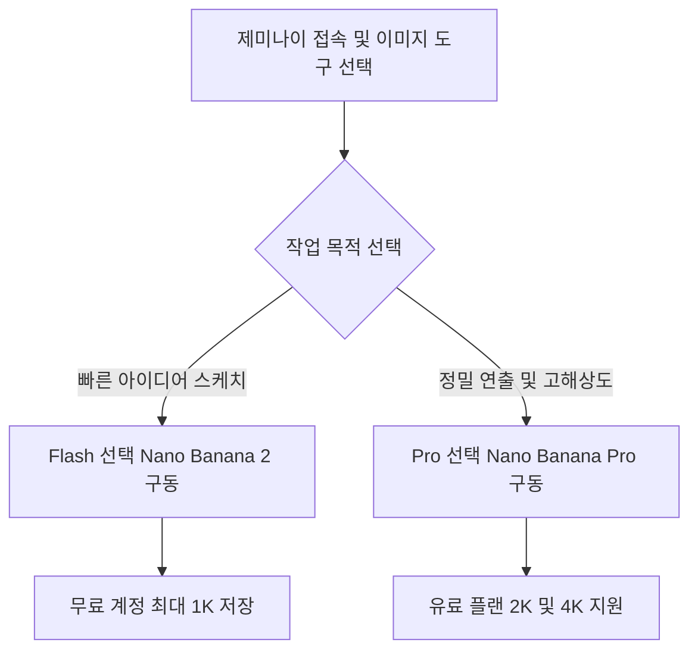

제미나이 화면에서 이미지 메뉴를 고르고 원하는 내용을 입력하면 나노바나나 엔진이 그림을 즉시 생성합니다. 일상적인 아이디어 구체화부터 고화질 인쇄물 작업까지 어떤 설정을 선택해야 할지 고민하는 작업자를 위해 핵심 작동 원리와 모델별 선택 기준을 체계적으로 정리해 드립니다.

> **먼저 알아둘 용어**
>
> - **프롬프트**: AI에게 건네는 지시문입니다. 같은 모델도 지시문에 따라 결과가 크게 달라집니다.
> - **API**: 다른 프로그램에서 이 기능을 불러다 쓸 수 있게 열어 둔 창구입니다.
> - **토큰**: AI가 글을 잘게 쪼개 세는 단위입니다. 한국어는 보통 한두 글자가 토큰 하나입니다.
{: .prompt-info }

## 제미나이 나노바나나 사용법과 모델별 엔진 차이

제미나이 화면 안에서 이미지 도구를 선택하고 원하는 묘사를 글로 적으면 나노바나나 엔진이 작동합니다.

컴퓨터 웹 브라우저나 스마트폰 제미나이 앱에 들어간 뒤 화면 왼쪽 사이드바나 하단 도구 메뉴에서 '이미지(Create images)'를 선택하면 그림 제작 환경이 열립니다. 화면 하단의 대화 입력창에 만들고 싶은 장면을 자연어 글(프롬프트)로 상세히 적거나, 직접 고치고 싶은 사진을 첨부하면 나노바나나가 지시 내용을 해석해 작업을 시작합니다.

이때 화면 상단에서 어떤 기본 모델을 지정해 두었는지에 따라 연동되는 나노바나나 세부 엔진이 달라집니다. 가볍고 응답 속도가 빠른 Flash-Lite 모델을 골라 두었다면 Nano Banana 2 Lite 엔진이 작동합니다. 표준 모델인 Flash 모델이나 Pro 모델을 활성화해 둔 상태라면 Nano Banana 2 엔진이 기본으로 연결됩니다. 단순한 시각 스케치나 가벼운 아이디어 탐색에는 기본 Flash 모델 기반의 제미나이 나노바나나 사용법만으로도 충분한 결과물을 얻을 수 있습니다.

결과물의 크기와 화질에서도 계정 상태에 따른 차이가 분명합니다. 요금을 내지 않는 일반 무료 사용자는 최대 1K(가로세로 약 1000화소 수준의 해상도) 크기로만 완성된 이미지를 내려받을 수 있습니다. 반면 Google AI 유료 요금제를 구독하는 사용자는 2K 해상도 다운로드가 제공되어 보다 선명한 결과물을 확보할 수 있습니다.

나노바나나 엔진으로 만들거나 수정한 모든 이미지 파일 내부에는 구글의 비가시적 SynthID 디지털 워터마크가 자동으로 적용됩니다. SynthID는 사람 눈에는 보이지 않지만 컴퓨터 프로그램이 검사하면 인공지능이 생성하거나 편집한 콘텐츠임을 정확하게 식별할 수 있는 위변조 방지 기술입니다. 이 워터마크는 사용자가 임의로 끄거나 제거할 수 없습니다.



작업을 시작하기 전에 자신이 웹 게시용 가벼운 이미지를 만드는지, 인쇄나 정밀 검토용 고품질 이미지를 만드는지 확인하고 알맞은 엔진을 지정하는 것이 올바른 순서입니다.

## 제미나이 나노바나나 프로 사용법과 정밀 편집 기능

나노바나나 프로는 Thinking이나 Pro 모델을 지정하거나 생성된 이미지 아래 Redo with Pro를 눌러 호출합니다.

전문적인 디자인이나 정밀한 수정이 필요할 때는 제미나이 나노바나나 프로 사용법을 숙지해야 합니다. 제미나이 상단 모델 설정에서 Thinking 또는 Pro 모델을 선택하면 Gemini 3 Pro Image 기반의 Nano Banana Pro 엔진이 연결됩니다. 일반 Flash 엔진으로 이미지를 먼저 생성한 상황이라도 결과물 옵션 메뉴에 나타나는 'Redo with Pro'를 누르면 기존 내용을 바탕으로 프로 엔진을 호출해 더 정밀하게 다시 그릴 수 있습니다.

프로 엔진의 독보적인 강점은 최대 4K 해상도를 지원하며 스튜디오 조명과 카메라 렌즈 각도를 자유롭게 제어할 수 있다는 점입니다. 기존 생성 도구에서 자주 발생하던 글자 깨짐 현상을 개선하여 텍스트 렌더링 정확도를 크게 높였습니다. 간판, 포스터 문구, 브랜드 이름 등을 흐트러짐 없이 똑바르게 묘사할 수 있으며, 조명의 세밀한 색온도나 시점 구도를 대화하듯 글로 지시해 바꿀 수 있습니다.

또한 여러 장의 참조 사진을 결합하면서 피사체의 외형 일관성을 유지하는 성능이 뛰어납니다. 대화형 인터랙션을 통해 캐릭터의 얼굴 생김새나 제품의 핵심 디테일을 망가뜨리지 않고 배경만 교체할 수 있습니다. 바꾸고 싶은 특정 영역을 말로 설명하면 전체를 덮어쓰지 않고 지정된 부분만 자연스럽게 수정해 줍니다.

온라인 게시판이나 제미나이 나노바나나 사용법 디시 글 등에서는 특정 화풍을 구현하기 위한 비공식 프롬프트 키워드 목록이 돌기도 합니다. 하지만 공식적으로 검증되지 않은 우회 명령어를 무리하게 조합하면 의도와 다른 형태가 나타나거나 업데이트 이후 작동하지 않을 수 있습니다. 검증되지 않은 인터넷 프롬프트를 맹신하기보다는 제미나이가 정식 지원하는 참조 이미지 업로드 기능과 구체적인 구도 지시어를 조합하는 것이 실패를 줄이는 가장 정석적인 방법입니다. 무료 사용자의 경우 서버 트래픽 상황에 따라 일일 생성 한도가 실시간으로 변동될 수 있으므로 대량 작업 시 주의해야 합니다.

| 구분 항목 | Nano Banana 2 | Nano Banana Pro |
| :--- | :--- | :--- |
| 기반 엔진 | Gemini 3.1 Flash Image | Gemini 3 Pro Image |
| 호출 모델 | Flash 또는 Pro 모델 기본 적용 | Thinking 모델 또는 Redo with Pro |
| 지원 해상도 | 일반 화질 (무료 1K, 유료 2K) | 최대 4K 해상도 지원 |
| 텍스트 표현 | 기본 수준 렌더링 | 향상된 텍스트 렌더링 정확도 |
| 연출 제어 | 기본 구도 생성 | 조명, 구도, 카메라 각도 제어 |
| 피사체 유지 | 기본 수준 일관성 | 복수 참조 결합 및 영역 부분 수정 |
| 워터마크 | SynthID 비가시적 워터마크 | SynthID 비가시적 워터마크 |

## 그래서 내 업무에는 뭐가 달라지나

블로그 본문 삽화나 사내 발표 자료용 초안을 제작하는 일반 실무자라면 유료 결제 없이 무료 플랜에서 Flash 모델을 쓰면 됩니다.

별도의 그래픽 프로그램을 설치할 필요 없이 웹이나 스마트폰 앱에서 즉시 사용할 수 있으므로 작업 시간이 크게 단축됩니다. 1K 해상도만으로도 모바일 화면이나 작은 웹 배너 영역에서는 충분히 깨끗하게 표현되므로 불필요하게 고가 요금제를 결제할 이유가 없습니다. 기획 회의 중에 메모한 손그림이나 거친 시안 사진을 업로드하고 구도를 다듬어 달라고 요청하면 몇 초 만에 정리된 초안을 얻을 수 있습니다.

반면 인쇄용 홍보물 제작, 패키지 디자인 시안, 정확한 글자가 들어가야 하는 상업용 이미지 제작자라면 구글 유료 요금제 가입 후 나노바나나 프로를 써야 합니다. 최대 4K 해상도를 지원하므로 대형 모니터나 출력물에서도 선명함이 유지됩니다. 여러 장의 참조 이미지를 분석해 인물과 제품의 형태를 유지하는 기능을 활용하면, 같은 주인공이 등장하는 연속 카드뉴스나 마케팅 배너를 제작할 때 일관성을 지킬 수 있습니다.

오늘 업무 환경에서 당장 실천할 수 있는 세부 행동 지침은 세 가지입니다.

첫째, 단순한 구상 단계라면 무료 제미나이 웹 화면에서 이미지 도구를 누르고 머릿속에 있는 장면을 문장으로 풀어 생성해 봅니다. 둘째, 기존 브랜드 제품이나 특정 인물 캐릭터의 형태를 지키며 배경을 바꿔야 한다면 기준 사진을 입력창에 첨부한 뒤 '인물 외형은 그대로 두고 배경을 도시 야경으로 변경해 줘'처럼 명확하게 지시합니다. 셋째, 생성된 시안의 글자 표현이 일그러지거나 조명 각도를 전문적으로 틀어야 한다면 결과물 아래 'Redo with Pro'를 선택해 프로 엔진으로 다시 렌더링합니다.

자신의 업무물이 웹 화면에서 일회성으로 소비되는 콘텐츠인지, 혹은 브랜드의 정밀한 디테일과 고해상도 출력이 필요한 공식 작업물인지 기준을 분명히 세우고 도구를 다루시기 바랍니다.

## 나노바나나 요금제와 개발자 API 비용 비교

나노바나나 프로 모델을 정기적으로 업무에 쓰려면 구글 구독 플랜이나 개발자 API의 비용 구조를 사전에 파악해야 합니다.

일반 웹과 스마트폰 앱에서 제미나이 3 프로 및 나노바나나 프로를 사용하려면 구글의 유료 구독 요금제에 가입해야 합니다. 입문자를 위한 저가 요금제인 'AI 플러스'는 월 1만 1,000원에 제공되며 매달 200 AI 크레딧을 지급합니다. 일상적인 프로 엔진 호출과 고화질 이미지 생성을 병행하기에 적합합니다. 더 많은 작업량을 처리해야 하는 전문 창작자라면 월 2만 9,000원에 제공되는 '구글 AI 프로' 상위 요금제를 선택하면 됩니다. 처음부터 고가 플랜을 결제하기보다는 월 1만 1,000원 플랜으로 시작하여 크레딧 사용량을 점검한 뒤 변경하는 편이 현명합니다.

사내 시스템 구축이나 자체 애플리케이션에 나노바나나 이미지 생성 기능을 탑재하려는 개발자는 Google Developer API 기준 요금표를 확인해야 합니다. 표준 엔진인 Nano Banana 2(Gemini 3.1 Flash Image)는 100만 출력 토큰당 $60.00의 요금이 부과됩니다. 실시간 응답이 급하지 않은 대용량 일괄 작업의 경우 Batch API를 활용하면 50% 할인된 100만 토큰당 $30.00 수준으로 이미지 출력이 가능합니다.

반면 최고급 성능을 제공하는 Nano Banana Pro(Gemini 3 Pro Image)는 100만 출력 토큰당 $120.00가 청구됩니다. 이미지 장당 단가로 환산하면 Standard 기준 1K 또는 2K 이미지는 1장당 약 $0.134이며, 최고 화질인 4K 이미지는 1장당 $0.24의 비용이 발생합니다. API 연동 시 해상도 선택에 따라 비용 차이가 발생하므로 서비스 목적에 맞춘 해상도 분기가 필수적입니다.

```chartjs
{
  "type": "bar",
  "data": {
    "labels": ["AI 플러스 구독", "구글 AI 프로 구독"],
    "datasets": [{
      "label": "월 구독료 (원)",
      "data": [11000, 29000],
      "backgroundColor": ["#2f9e8f", "#1d6f63"]
    }]
  },
  "options": {
    "responsive": true
  }
}
```

개인 창작이나 수동 시안 검토는 월 정액 요금제를 활용하고, 대량의 이미지를 주기적으로 자동 생성해야 하는 서비스 개발 환경이라면 API 장당 출력 비용을 면밀히 계산해 예산을 편성하시기 바랍니다.

<!-- internal-links:start -->
## 함께 읽으면 이해가 이어지는 글

- [챗GPT 유료 무료 차이와 플랜별 가격 비교 가이드]() — 챗GPT 무료 플랜은 단순 대화가 무제한이지만 파일 분석과 이미지 생성 등 부가 도구에 엄격한 제한이 있습니다. 본 가이드는 Go(8달러), Plus(20달러), Pro(200달러), Business 플랜의 핵심 사양과 가격 차이를…
- [이미지 생성 Step을 1에서 50까지 바꿔도 될까? Self-E의 Any-Step 학습]() — Self-E가 별도 teacher distillation 없이 flow matching의 local supervision과 자체 sample 평가를 결합해 하나의 weight로 1~50 step 생성을 지원하는 원리와 비용을…
- [그림을 지우지 않고 토끼를 코끼리로 바꿀 수 있을까: Stroke of Surprise의 Prefix, Delta 최적화]() — 먼저 그린 선을 지우지 않는 점진적 의미 착시에서 이중 SDS와 Overlay Loss가 해결하는 문제와 실패 조건을 살펴봅니다.
<!-- internal-links:end -->

## 자주 묻는 질문

### 무료 사용자도 나노바나나 프로 엔진을 계속해서 사용할 수 있나요?

무료 계정에서는 기본적으로 Nano Banana 2 Lite 및 Nano Banana 2 엔진이 작동하며 최대 1K 해상도로 내려받을 수 있습니다. Thinking 모델 선택을 통한 정밀 제어나 4K 고화질 나노바나나 프로 엔진을 정기적으로 이용하려면 AI 플러스(월 1만 1,000원) 이상의 유료 요금제 구독이 필요합니다.

### 생성된 이미지에 포함된 SynthID 워터마크를 제거하는 방법이 있나요?

제거할 수 없습니다. SynthID는 인공지능으로 제작되거나 편집된 디지털 콘텐츠임을 식별할 수 있도록 픽셀 내부에 비가시적으로 삽입되는 구글의 고유 기술이며, 나노바나나로 생성된 모든 파일에 기본 탑재됩니다.

### 나노바나나 프로에서 캐릭터 외형을 유지하며 배경만 바꾸려면 어떻게 해야 하나요?

제미나이 대화창에 기준이 되는 참조 사진을 먼저 첨부한 뒤, 보존하고자 하는 캐릭터의 특징을 명시하고 바꾸고 싶은 배경 환경이나 카메라 각도만을 자연어 프롬프트로 지시하면 외형 일관성을 유지하며 부분 수정할 수 있습니다.

### 개발자 API로 나노바나나 프로 4K 이미지를 1장 생성할 때 비용은 얼마인가요?

Google Developer API 기준 Nano Banana Pro(Gemini 3 Pro Image)의 4K 해상도 이미지는 1장당 $0.24의 출력 비용이 발생합니다. 1K 또는 2K 해상도는 1장당 약 $0.134가 청구됩니다.

## 직접 확인한 원문

- [Google 고객센터 (Gemini 앱으로 이미지 생성 및 수정하기 - 컴퓨터)](https://support.google.com/gemini/answer/14286560?hl=ko&co=GENIE.Platform%3DDesktop) (2026-09-18 확인)
- [Google 고객센터 (Gemini 앱으로 이미지 생성 및 수정하기 - Android)](https://support.google.com/gemini/answer/14286560?hl=ko-KR&co=GENIE.Platform%3DAndroid) (2026-09-18 확인)
- [Google Gemini 공식 포털](https://gemini.google/overview/image-generation) (2026-09-18 확인)
- [Android 공식 웹사이트](https://www.android.com/intl/ko_kr/articles/what-is-nano-banana) (2026-09-18 확인)
- [Google AI Studio](https://aistudio.google.com/models/nano-banana) (2026-09-18 확인)
- [Google AI for Developers](https://ai.google.dev/gemini-api/docs/image-generation?hl=ko) (2026-09-18 확인)
- [Google AI for Developers (Gemini Developer API pricing)](https://ai.google.dev/gemini-api/docs/pricing) (2026-09-18 확인)
- [동아일보](https://www.donga.com/news/It/article/all/20260128/133248533/1) (2026-09-18 확인)

위 수치는 확인 시점 기준이며 예고 없이 바뀔 수 있습니다. 결정 전에 공식 페이지를 한 번 더 확인하시기 바랍니다.
