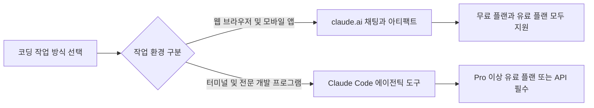
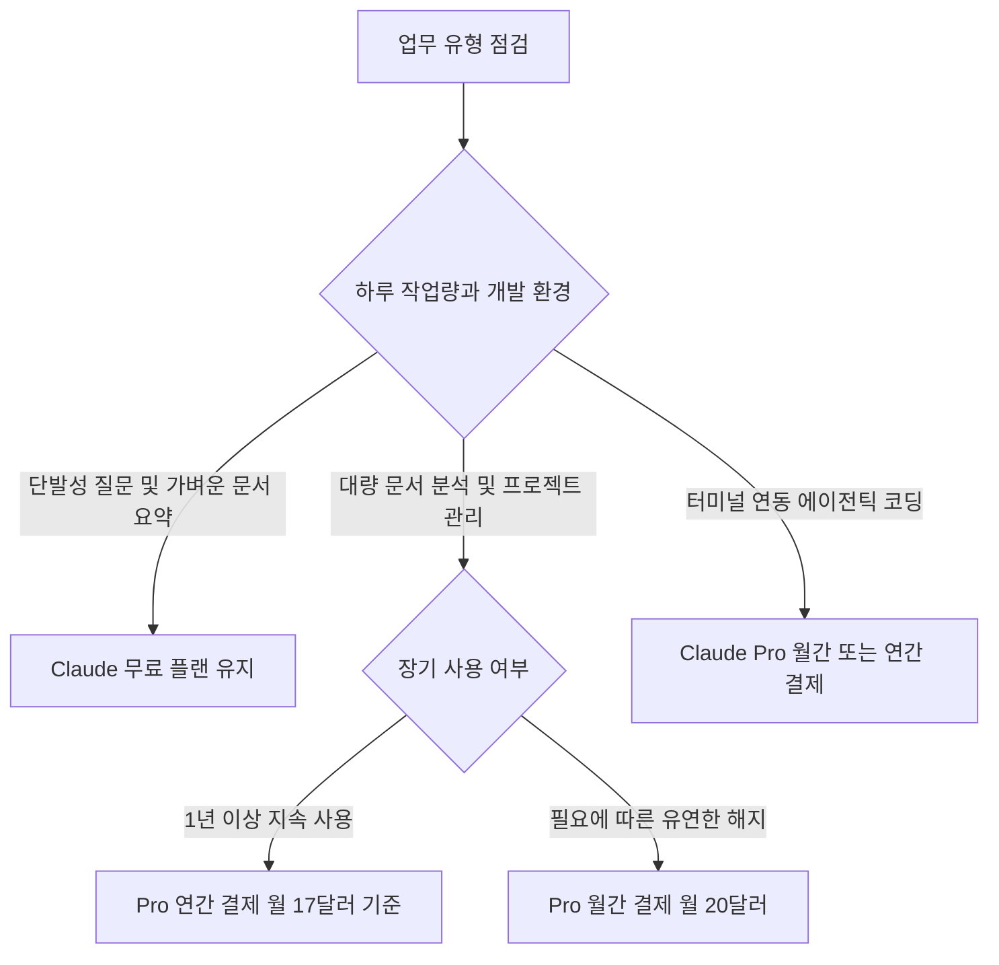

클로드 ai 무료 유료 차이의 핵심은 사용량 한도와 코딩 도구 지원 여부입니다. 단순한 대화나 짧은 글 작성은 비용 없이도 충분하지만 업무 흐름을 끊김 없이 이어가려면 유료 플랜이 필요합니다.

어떤 기능이 무료로 열려 있고 어디서부터 유료 결제가 필요한지 경계가 모호하면 불필요한 구독료를 내거나 작업 도중 대화가 끊기는 불편을 겪게 됩니다. 이 글은 무료 요금제의 실질적인 사용 범위부터 Pro, Team, Max 요금제의 가격과 기능 차이를 빠짐없이 정리하여 독자가 본인에게 맞는 결정을 바로 내릴 수 있도록 돕습니다.

> **먼저 알아둘 용어**
>
> - **추론**: 학습이 끝난 모델이 실제로 답을 만들어 내는 과정입니다. 이때 드는 계산 비용이 곧 사용료입니다.
{: .prompt-info }

## 클로드 ai 무료 유료 차이와 핵심 기능 비교

클로드 ai 무료 플랜은 신용카드 정보를 등록하지 않고 0달러로 즉시 쓸 수 있는 기본 서비스입니다. 비용을 내지 않아도 웹 브라우저와 컴퓨터 데스크톱 프로그램, 스마트폰 모바일 앱 환경에서 자유롭게 이용할 수 있습니다. 텍스트 대화뿐만 아니라 웹 검색, 파일 생성, 코드 실행 기능을 기본으로 지원합니다. 대화 간 메모리(이전 대화에서 나눈 사용자의 기본 설정이나 맥락을 기억해 다음 대화에 반영하는 기능)와 아티팩트(Artifacts, 작성된 문서나 프로그래밍 코드를 대화창 옆에 별도 창으로 띄워 실시간으로 확인하는 독립 작업창)도 무료 티어에서 온전히 동작합니다. 독립된 짧은 프로그램 코드 검토나 일상적인 자료 요약은 클로드 ai 무료 요금제만으로 충분히 해결할 수 있습니다.

반면 유료 플랜인 Claude Pro는 월간 결제 시 월 20달러(미국 기준, 세금 별도)이며 연간 결제 시 1년 치 200달러를 한 번에 지불하여 월 17달러 수준으로 이용합니다. Pro 플랜을 결제하면 무료 사용자 대비 질문할 수 있는 한도가 세션당 최소 5배 이상 늘어납니다. 많은 사람이 동시에 몰리는 시간대에도 답변 생성이 지연되지 않는 우선 접근권을 얻으며, 새로운 기능이 나왔을 때 남들보다 먼저 써보는 조기 접근 권한도 함께 받습니다. 복잡한 문제를 깊게 추론하는 상위 모델인 Opus를 포함하여 여러 모델을 작업 목적에 맞게 골라 쓸 수 있는 점도 유료 플랜만의 중요한 특징입니다.

작업 관리 도구와 외부 프로그램 연동 측면에서도 두 플랜은 분명하게 갈립니다. Claude Pro 구독자는 프로젝트(Projects, 관련된 여러 문서와 참고 자료를 한 폴더에 모아두고 일관된 배경 지식을 유지하며 대화하는 작업 공간) 기능을 사용할 수 있습니다. 슬라이드나 문서를 시각적으로 다듬는 전용 도구와 구글 크롬 브라우저 확장, 마이크로소프트 365(사무용 문서 작성과 클라우드 저장소를 묶은 프로그램 제품군) 연동도 유료 사용자에게만 열립니다. 무료 요금제 사용자는 프로젝트 폴더를 만들 수 없으므로 대화창이 바뀔 때마다 긴 배경 자료를 매번 새로 올려야 하는 한계가 따릅니다.

| 비교 항목 | Claude 무료 플랜 | Claude Pro 플랜 |
| :--- | :--- | :--- |
| 기본 요금 | 0달러 (신용카드 등록 없음) | 월 20달러 (연간 결제 시 월 17달러) |
| 세션당 사용 한도 | 가변적 기본 한도 | 무료 플랜 대비 최소 5배 이상 |
| 혼잡 시간대 접속 | 대기 또는 지연 가능 | 우선 접근권(Priority access) 보장 |
| 모델 선택 | 기본 모델 제공 | Opus 등 추가 모델 선택 지원 |
| 핵심 부가 기능 | 메모리, 아티팩트, 웹 검색, 코드 실행 | 프로젝트, Claude Code, 외부 소프트웨어 연동 |

```chartjs
{
  "type": "bar",
  "data": {
    "labels": ["Free", "Pro 연간 환산", "Pro 월간", "Team 연간 환산", "Team 월간", "Max 시작가"],
    "datasets": [{
      "label": "월 환산 요금 달러",
      "data": [0, 17, 20, 20, 25, 100],
      "backgroundColor": ["#9aa5a1", "#43b9a7", "#2f9e8f", "#388e83", "#287067", "#1d6f63"]
    }]
  },
  "options": {
    "responsive": true
  }
}
```

## 클로드 ai 코딩 사용법과 클로드 코드 차이

클로드 ai 코딩 사용법은 일반 대화창을 통한 코드 상담과 전용 개발 도구인 Claude Code를 통한 컴퓨터 제어로 명확히 구분됩니다. 일반 웹 화면(claude.ai)이나 앱에서는 대화창에 작성 중인 코드를 붙여 넣고 버그를 찾아달라고 요청하거나 새로운 함수를 만들어 달라고 요청합니다. 이때 화면 한편에 열리는 아티팩트 창에서 자바스크립트나 HTML 코드가 작동하는 모습을 바로 확인할 수 있습니다. 알고리즘 문제를 풀거나 짧은 스크립트의 문법 오류를 점검하는 단발성 작업은 이 웹 대화창만으로도 충분히 처리할 수 있습니다.

반면 클로드 ai 클로드 코드 차이는 프로그램이 실행되는 물리적 위치와 사용자의 실제 프로젝트 파일에 접근하는 권한 수준에서 나타납니다. Claude Code는 웹 브라우저 대화창이 아니라 개발자의 컴퓨터 터미널(CLI, 글자 명령어를 직접 입력하여 컴퓨터를 다루는 명령줄 환경)이나 VS Code, JetBrains IDE 같은 전문 소프트웨어 개발 도구 안에서 직접 돌아가는 에이전틱 코딩 도구(인공지능이 스스로 판단하여 파일 탐색, 코드 작성, 테스트 실행을 연속해서 수행하는 도구)입니다. 대화창에 코드를 일일이 복사해서 옮길 필요 없이 프로젝트 폴더 전체를 직접 읽고 수십 개의 관련 소스 코드를 넘나들며 버그를 고칩니다.

Claude Code는 터미널 안에서 빌드 명령어를 스스로 실행하고 오류가 발생하면 에러 로그를 읽어 스스로 코드를 다시 고치는 작업까지 해냅니다. 하지만 이 도구는 무료 요금제 사용자에게는 접근 권한이 전혀 열리지 않습니다. Claude Code를 설치하여 업무에 활용하려면 반드시 Claude Pro 이상의 유료 플랜을 구독하고 있거나 개발자용 콘솔 API(다른 소프트웨어와 통신할 때 사용하는 연결 창구) 계정을 연결해야 합니다. 프로젝트 전체를 맡겨 자동으로 수정하고 테스트하는 환경을 꾸리려면 유료 전환이 필수입니다.



## 그래서 내 업무에는 뭐가 달라지나

클로드 ai 요금제 추천은 독자가 하루 동안 소화하는 업무량과 도구 연동의 깊이에 따라 세 가지 행동으로 귀결됩니다. 무료 플랜은 비용이 전혀 들지 않지만 사용량이 몰리면 대화가 일시 중단되는 한계가 있습니다. 유료 플랜은 매달 정기 결제가 발생하는 대신 5배 이상의 사용량과 프로젝트 단위의 맥락 보존, 터미널 코딩 연동을 제공하여 업무 중단을 원천적으로 차단합니다.

클로드 ai 무료 다운로드를 마쳤거나 가입을 고민 중인 독자는 오늘 자신의 업무 특성에 맞춰 다음 세 가지 중 하나를 즉시 선택하세요. 첫째, 질문 횟수가 하루 10회 미만이며 단발성 이메일 초안 다듬기, 외국어 번역, 짧은 문서 요약 위주로 쓴다면 무료 요금제를 유지하세요. 추가 결제 없이 웹 브라우저나 데스크톱 앱에서 클로드 ai 무료 사용법을 익히고 아티팩트와 메모리 기능만 챙겨도 일상 업무를 충분히 보조받을 수 있습니다. 둘째, 매일 수십 장 분량의 보고서를 분석하거나 여러 프로젝트를 동시에 운영하여 이전 대화 맥락을 계속 이어가야 한다면 Pro 플랜을 구독하세요. 월 20달러 결제로 세션당 한도를 5배 이상 늘리고 Projects 기능을 열어 매번 배경 자료를 다시 올리는 시간 낭비를 없애야 합니다. 장기적으로 1년 이상 활용할 계획이 확실하다면 연간 구독을 선택하여 200달러를 일시 지불하고 매달 3달러씩 지출을 줄이는 편이 경제적입니다.

셋째, 소프트웨어 개발자로서 VS Code나 터미널 안에서 프로젝트 코드베이스 전체를 인공지능이 분석하고 수정하게 만들고 싶다면 Pro 요금제를 구독하거나 API 계정을 준비하세요. Claude Code는 무료 사용자에게 제공되지 않으므로 터미널 연동 코딩 환경을 구축하려면 Pro 이상의 유료 계정이 반드시 필요합니다. 단, 스마트폰 앱스토어 인앱결제를 거치면 환율과 결제 수수료로 인해 원화 청구액이 웹 결제와 다를 수 있으므로 공식 웹페이지를 통해 달러 기준으로 결제 수단을 등록하는 것이 비용 계산에 안전합니다.



## 요금제 선택 시 주의할 사용량 한도와 추가 비용

클로드 ai 요금제 차이의 숨은 핵심은 사용량 한도 관리 방식과 외부 결제 체계에 있습니다. Claude Pro와 Claude Code는 5시간 롤링 윈도우(최근 5시간 동안 누적된 요청량을 실시간으로 계산하여 한도를 책정하는 방식)와 주간 단위 컴퓨팅 한도로 사용량을 통제합니다. 질문을 짧은 시간 안에 집중해서 던지면 다음 5시간 주기가 돌아올 때까지 일시적으로 질문 전송이 제한됩니다. 무료 요금제 역시 일정한 사용 제한이 적용되지만 구체적인 5시간당 메시지 횟수 상한선은 서버 트래픽과 질문의 길이에 따라 실시간으로 변동되므로 고정된 수치로 단언할 수 없습니다.

가장 주의해야 할 지점은 claude.ai 웹 채팅과 Claude Code 개발 도구가 단일 버킷으로 사용량 쿼터를 공유한다는 사실입니다. 웹 화면에서 긴 보고서를 분석하느라 대화 용량을 크게 소모했다면 같은 시간대에 터미널에서 Claude Code를 쓸 때 남은 한도가 급격히 줄어듭니다. 두 도구가 독립된 사용량을 제공하는 것이 아니라 하나의 계정 한도를 함께 깎아 먹기 때문입니다. 이 쿼터 공유 구조를 모르면 개발 작업을 시작하자마자 사용량 초과 안내를 받고 대기해야 하는 상황이 생길 수 있습니다.

개발자용 콘솔 API 과금 체계와 상위 요금제 조건도 명확히 구분해야 합니다. 웹이나 앱에서 결제한 Pro 플랜 구독권은 개발자용 Claude Console을 통해 호출하는 API 사용량에는 적용되지 않습니다. 콘솔을 통해 API를 호출할 때는 Pro 구독 여부와 무관하게 사용량에 따라 별도의 요금이 청구됩니다. 한편 개인의 작업량이 극단적으로 많아 Pro의 한도로도 부족하다면 월 100달러부터 시작하는 Claude Max 요금제를 선택할 수 있습니다. Max 요금제는 Pro 대비 5배 또는 20배의 작업량을 제공합니다. 팀원 여러 명이 협업 공간을 공유해야 한다면 멤버당 월 25달러(연간 결제 시 멤버당 월 20달러)로 책정된 Claude Team 플랜을 선택하여 협업 환경을 구축해야 합니다.

<!-- internal-links:start -->
## 함께 읽으면 이해가 이어지는 글

- [stablyai/orca: 멀티 AI 에이전트를 격리된 환경에서 병렬 실행하는 ADE 개발 플랫폼]() — stablyai/orca는 Claude Code, OpenAI Codex, Cursor CLI 등 여러 AI 코딩 에이전트를 단일 프로젝트 내에서 충돌 없이 병렬로 제어하는 오픈소스 ADE(Agent Development…
- [openai/codex-plugin-cc: Claude Code와 Codex가 하나의 에디터에서 만났을 때 일어나는 일]() — Anthropic의 Claude Code 환경 내에서 OpenAI의 Codex를 백그라운드로 호출하여 하이브리드 멀티 에이전트 워크플로우를 구현하는 플러그인의 작동 원리와 실전 활용법을 알아봅니다.
- [cc-switch: 여러 AI 코딩 도구의 API 설정과 프로바이더를 한곳에서 관리하는 데스크톱 제어 센터]() — cc-switch는 Claude Code, OpenAI Codex, Gemini CLI 등 다양한 AI 코딩 도구의 프로바이더 설정과 API 키를 통합 관리하는 오픈소스 데스크톱 애플리케이션입니다. 로컬 프록시 게이트웨이, 자동…
<!-- internal-links:end -->

## 자주 묻는 질문

### 클로드 무료 요금제만으로도 주요 기능을 쓸 수 있나요?

신용카드 등록 없이 0달러로 웹, 데스크톱, 모바일 앱에서 대화, 실시간 웹 검색, 파일 생성, 코드 실행, 대화 간 메모리, 아티팩트(Artifacts) 기능을 모두 쓸 수 있습니다.

### Claude Pro와 무료 플랜의 핵심 차이는 무엇인가요?

Pro는 월 20달러(연간 결제 시 월 17달러)로 무료 대비 최소 5배 이상의 사용량 한도, 혼잡 시간대 우선 접근권, 신규 기능 조기 접근, Opus 등 추가 모델 선택, 프로젝트(Projects) 폴더 기능, Claude Code 사용 권한을 제공합니다.

### 터미널 코딩 도구인 Claude Code를 무료로 쓸 수 있나요?

무료 요금제에서는 Claude Code를 쓸 수 없습니다. 터미널이나 IDE에서 프로젝트 소스 코드를 직접 수정하는 에이전틱 코딩을 하려면 Claude Pro 이상의 유료 플랜 구독이나 개발자용 콘솔 API 계정이 필요합니다.

### Claude Pro를 결제하면 개발자용 콘솔 API도 무료로 포함되나요?

포함되지 않습니다. Pro 구독은 claude.ai 채팅 인터페이스에만 적용되며, 개발자용 Claude Console을 통한 API 호출량은 별도로 요금이 청구됩니다.

## 직접 확인한 원문

- [Plans & Pricing | Claude by Anthropic](https://claude.com/pricing) (2026-09-19 확인)
- [What is the Pro plan? | Claude Help Center](https://support.claude.com/en/articles/8325606-what-is-the-pro-plan) (2026-09-19 확인)
- [What is the Team plan? | Claude Help Center](https://support.claude.com/en/articles/9266767-what-is-the-team-plan) (2026-09-19 확인)
- [Overview - Claude Code Docs](https://code.claude.com/docs/en/overview) (2026-09-19 확인)
- [Truefoundry](https://www.truefoundry.com/blog/claude-code-limits-explained) (2026-09-19 확인)

위 수치는 확인 시점 기준이며 예고 없이 바뀔 수 있습니다. 결정 전에 공식 페이지를 한 번 더 확인하시기 바랍니다.
