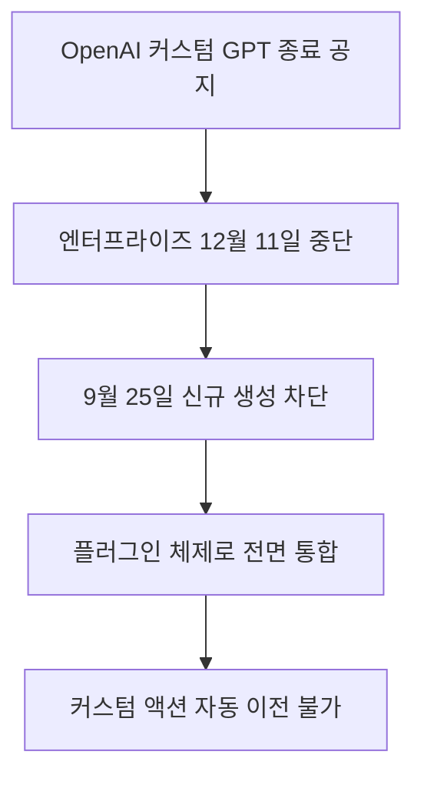

OpenAI가 ChatGPT 요금제 전반에서 커스텀 GPT를 단계적으로 종료하고 플러그인으로 이전하는 경로를 제공할 계획이라고 공식 Help Center 문서를 통해 발표했습니다. 내가 만들어 둔 맞춤형 인공지능 비서가 사라질 예정이라 업무 흐름에 영향을 받는 사용자라면 빠른 대비가 필요합니다. 맞춤형 도구를 활용하던 직장인과 실무자는 이제 기존 프롬프트와 연동 설정을 새로운 규격에 맞춰 정리해야 합니다. 이번 변화는 단순한 디자인 변경이 아니라 사용자가 인공지능 도구를 구축하고 운영하는 체계 전체가 바뀌는 구조적인 개편입니다.

> **먼저 알아둘 용어**
>
> - **프롬프트**: AI에게 건네는 지시문입니다. 같은 모델도 지시문에 따라 결과가 크게 달라집니다.
{: .prompt-info }

## 무슨 일이 벌어진 걸까?

OpenAI는 공식 Help Center 문서를 통해 ChatGPT 요금제 전반에서 커스텀 GPT를 단계적으로 종료하고 플러그인 체계로 옮겨가는 전환 계획을 공지했습니다 <a href="#source-1" aria-label="OpenAI Help Center 출처">[1]</a>. 이번 개편에서 가장 큰 영향을 받는 기업용 Enterprise 워크스페이스는 **2026년 9월 25일에 신규 커스텀 GPT 생성이 종료**될 예정입니다 <a href="#source-1" aria-label="OpenAI Help Center 출처">[1]</a>. 신규 생성이 멈춘 뒤에도 기존에 만들어 둔 봇은 얼마 동안 계속 쓸 수 있습니다. 하지만 **2026년 12월 11일에는 커스텀 GPT의 작동이 완전히 중단**됩니다 <a href="#source-1" aria-label="OpenAI Help Center 출처">[1]</a>. 그 날이 지나면 기존에 설정해 둔 커스텀 GPT는 더 이상 사용자 질문에 대답하지 못합니다.

커스텀 GPT를 대체하는 새로운 환경은 표준화된 플러그인 아키텍처입니다. 아키텍처란 소프트웨어를 구성하는 기본 뼈대나 구조를 뜻합니다. 이번에 도입되는 플러그인 아키텍처는 ChatGPT와 Codex 환경 전반에서 재사용할 수 있는 지침을 스킬 단위로 패키징하고, 연동된 앱과 외부 도구를 하나로 결합하는 방식입니다 <a href="#source-2" aria-label="PCWorld 출처">[2]</a>. Codex는 컴퓨터 코드를 읽고 작성하는 인공지능 모델 환경입니다. 기존에는 웹 화면에서 프롬프트를 입력하고 문서를 올리는 방식으로 커스텀 GPT를 쉽게 만들었지만, 앞으로는 개발 환경과 더 긴밀히 연결되는 플러그인 형태로 통합됩니다.

기존 커스텀 GPT를 플러그인으로 이전하더라도 원본 GPT가 바로 지워지는 것은 아닙니다. 기존 커스텀 GPT를 플러그인으로 이전한 후에도 원본 GPT는 최종 종료일까지 계속 사용할 수 있으나 읽기 전용 상태로 전환됩니다 <a href="#source-1" aria-label="OpenAI Help Center 출처">[1]</a>. 읽기 전용이란 새로운 지침을 고치거나 설정을 바꿀 수 없고 오직 실행만 가능한 상태를 의미합니다. 한 번 이전 작업을 마치면 원래 화면에서는 수정 작업을 할 수 없으므로 주의가 필요합니다. 사용자는 플러그인으로 넘어가기 전에 기존 지침과 설정이 제대로 정돈되어 있는지 꼼꼼하게 검토해야 합니다. 한 번 바뀐 설정은 기존 화면에서 되돌릴 수 없기 때문입니다.

OpenAI가 공개한 기술 지원 도움말에 따르면 이번 조치는 전사적인 통합 전략의 일환입니다 <a href="#source-1" aria-label="OpenAI Help Center 출처">[1]</a>. 기업 업무 환경에서 각자 파편화되어 운영되던 맞춤형 챗봇들을 하나의 공통 규격으로 모아 관리 효율성을 높이려는 목적이 담겨 있습니다. 개별 사용자가 각자 브라우저에서 만들어 쓰던 챗봇 방식 대신 체계적인 개발 파이프라인과 결합할 수 있는 플러그인 생태계를 선택한 셈입니다.

<figure class="news-source-image">
  
  <figcaption>PCWorld가 원문과 함께 공개한 이미지입니다. <a href="https://www.pcworld.com/article/3238025/custom-gpts-in-chatgpt-are-going-away-heres-how-to-save-yours.html" target="_blank" rel="noopener noreferrer">출처: PCWorld</a></figcaption>
</figure>

## 왜 지금 다들 이 이야기를 할까?

많은 기업과 개인 실무자가 업무 자동화 목적으로 커스텀 GPT를 적극적으로 만들어 사용해 왔기 때문에 이번 변화는 큰 화제가 되고 있습니다. 회사 내부 문서를 업로드해 두거나 사내 API(프로그램끼리 데이터를 주고받는 규칙)를 연동해 맞춤형 챗봇으로 활용하던 곳들이 많았습니다. 이번 조치로 인해 지금까지 구축해 둔 수많은 맞춤 챗봇이 정해진 마감 일정 안에 새로운 규격으로 전환되지 못하면 서비스가 멈추는 상황을 맞이하게 됩니다. 실무 현장에서는 그동안 잘 돌아가던 비서가 하루아침에 멈추는 사태를 가장 두려워하고 있습니다.

특히 가장 큰 문제는 커스텀 액션의 이전 방식입니다. 커스텀 액션이란 챗봇이 외부 서버와 통신하며 데이터를 가져오거나 특정 작업을 수행하도록 돕는 연결 통로입니다. OpenAI는 **기존 커스텀 GPT의 커스텀 액션이 플러그인 이전 시 자동으로 이전되지 않으며 별도의 연동 작업으로 다시 구축되어야 한다**고 확인했습니다 <a href="#source-1" aria-label="OpenAI Help Center 출처">[1]</a>. 프롬프트 지침이나 파일은 옮겨지더라도, 외부 서비스를 부르던 핵심 기능은 엔지니어가 직접 새로운 플러그인 규격에 맞춰 다시 개발해야 한다는 뜻입니다.

이 때문에 기업용 업무 환경을 관리하는 담당자들은 발등에 불이 떨어졌습니다. 예를 들어 사내 기술 지원 봇이나 고객 응대 봇처럼 외부 데이터베이스를 조회하던 핵심 업무 도구가 2026년 12월 11일 이후 작동을 멈춘다면 일상적인 업무 흐름에 병목이 발생할 수 있습니다. IT 기술 전문 매체인 PCWorld 역시 커스텀 GPT 서비스가 사라지는 흐름을 집중 조명하며 기존에 만들어 둔 데이터와 작업물을 보존해야 한다고 강조했습니다 <a href="#source-2" aria-label="PCWorld 출처">[2]</a>.

실무자들의 대화방이나 사내 협업 도구에서도 대책 마련을 요구하는 목소리가 높아지고 있습니다. 마우스 조작만으로 간단히 웹 API를 붙여 쓰던 비개발 실무자들은 커스텀 액션을 다시 만들어야 한다는 조건에 큰 부담을 느끼고 있습니다. 개발 인력이 부족한 팀이나 혼자서 여러 시스템을 운영하던 조직에서는 마감 기한 전까지 모든 연동을 새로 코딩할 수 있을지 우려가 커지는 상황입니다.

## 그래서 우리에게 뭐가 달라질까?

기존 커스텀 GPT 방식과 새롭게 개편되는 플러그인 아키텍처 방식은 운영 구조와 유지보수 방식에서 뚜렷한 차이를 보입니다. 두 환경이 어떻게 달라지는지 이해하기 쉽게 표로 정리해 보았습니다.

| 비교 항목 | 기존 커스텀 GPT | 새로운 플러그인 아키텍처 |
| --- | --- | --- |
| 구동 환경 | ChatGPT 단독 환경 | ChatGPT와 Codex 통합 환경 |
| 지침 관리 | 웹 화면 내 사용자 맞춤 지침 | 스킬 단위로 패키징된 재사용 지침 |
| 외부 연동 | 화면 내 커스텀 액션 설정 | 앱과 도구를 결합한 별도 연동 구축 |
| Enterprise 신규 생성 | 2026년 9월 25일 종료 | 지속 지원 및 권장 |
| Enterprise 최종 작동 | 2026년 12월 11일 완전 중단 | 장기 운영 지원 |
| 이전 후 원본 상태 | 기준 없음 | 최종 종료일까지 읽기 전용 유지 |

기존 커스텀 GPT는 웹 브라우저에서 대화하듯 프롬프트를 적고 파일을 첨부하면 즉시 완성되는 단순함이 장점이었습니다. 하지만 인공지능 모델이 고도화되고 복잡한 코딩과 외부 도구 제어가 중요해지면서 단일 프롬프트 포장 방식은 한계에 부딪혔습니다. 새로운 플러그인 구조는 ChatGPT뿐 아니라 Codex 환경까지 포괄하여 인공지능이 실제 소프트웨어를 제어하고 다단계 업무를 수행하도록 설계되었습니다 <a href="#source-2" aria-label="PCWorld 출처">[2]</a>.

반면 사용 난이도는 올라갈 가능성이 큽니다. 일반 사용자 입장에서는 마우스 클릭 몇 번으로 끝나던 챗봇 생성이 사라지고, 스킬과 도구를 패키징하는 조금 더 체계적인 과정을 거쳐야 합니다. 프롬프트를 다듬어 공유하던 창작자나 사내 지식 관리 봇을 운영하던 실무자는 앞으로 인공지능 도구를 다룰 때 개발자 도구의 작동 방식을 어느 정도 이해해야 하는 숙제를 안게 되었습니다. 코드를 직접 다루지 않던 사용자도 소프트웨어 배포 규격을 고려해야 하는 환경으로 진입하고 있습니다.

결국 사용자는 도구의 신뢰성과 확장성을 얻는 대신 가벼운 즉흥성을 내려놓아야 합니다. 기존에는 사내 회의에서 나온 아이디어를 그 자리에서 몇 분 만에 챗봇으로 만들어 배포할 수 있었습니다. 그러나 앞으로는 재사용 지침을 스킬로 묶고 연동 도구의 보안과 규격을 검토하는 정식 작업 단계를 거쳐야 합니다. 업무의 안정성은 향상되겠지만 초기 진입 장벽이 높아지는 것은 피하기 어렵습니다.

<figure class="news-source-image">
  
  <figcaption>PCWorld가 원문과 함께 공개한 이미지입니다. <a href="https://www.pcworld.com/article/3238025/custom-gpts-in-chatgpt-are-going-away-heres-how-to-save-yours.html" target="_blank" rel="noopener noreferrer">출처: PCWorld</a></figcaption>
</figure>

## 그래서 내 업무에는 뭐가 달라지나

Enterprise 워크스페이스를 사용하는 직장인 실무자와 기업 관리자는 오늘 당장 업무 현장에서 취할 수 있는 구체적인 행동을 시작해야 합니다.

- 먼저 현재 사내 워크스페이스에서 활성화되어 있는 커스텀 GPT 목록을 전수 조사합니다. 사용 빈도가 높거나 외부 서버와 연결된 커스텀 액션을 쓰는 봇이 무엇인지 확인하고 문서화해야 합니다.
- 다음으로 커스텀 GPT 설정 화면에 들어가 프롬프트 지침 전문과 업로드된 지식 베이스 파일 목록을 별도의 로컬 문서로 백업합니다. 플러그인으로 한 번 이전하면 원본 GPT가 읽기 전용으로 잠기기 때문에 원본 텍스트를 미리 안전하게 복사해 두는 작업이 필수적입니다.
- 마지막으로 외부 API와 통신하는 커스텀 액션이 있는 경우 사내 개발팀이나 기술 담당자에게 공유하고 플러그인 규격으로 다시 구축하는 일정을 수립합니다. 자동 마이그레이션이 지원되지 않으므로 2026년 12월 11일 이전에 재구축을 완료해야 업무 공백을 막을 수 있습니다.

개발자가 아닌 일반 직장인이라도 자신이 매일 쓰던 봇이 중단되지 않도록 관리자에게 이전 계획을 문의해야 합니다. 미리 백업하지 않으면 2026년 12월 11일 이후 소중한 업무 노하우가 담긴 프롬프트 설정을 잃어버릴 수 있습니다. 일상적인 문서 요약이나 단순 프롬프트 기반 봇이라면 텍스트를 복사해 두는 것만으로도 대부분의 자산을 지킬 수 있습니다. 하지만 사내 인트라넷이나 고객 관리 시스템과 연결되어 있던 도구라면 기술 부서와의 긴밀한 협력이 없이는 멈출 수밖에 없습니다. 남은 일정을 고려해 업무 우선순위를 정하고 이전 대상을 선별하는 작업이 지금 가장 시급합니다.

## 아직은 선을 그어야 할 부분

이번 발표를 접할 때 모든 사용자에게 동일한 날짜가 적용된다고 확대 해석해서는 안 됩니다. 현재 구체적인 서비스 종료 마감일이 명시된 곳은 Enterprise 워크스페이스뿐입니다 <a href="#source-1" aria-label="OpenAI Help Center 출처">[1]</a>. **Free, Go, Plus, Pro 요금제를 포함한 개인 계정의 구체적인 서비스 종료 및 중단 날짜는 아직 정해지지 않았습니다**. OpenAI는 향후 개별 계정 공지를 통해 개인 요금제의 일정을 안내하겠다고 밝혔으므로 개인 사용자에게 2026년 9월 25일이나 12월 11일이라는 날짜가 그대로 적용된다고 단정할 수 없습니다.

또한 비개발자 사용자를 위한 구체적인 지원 방안도 여전히 불확실합니다. Codex나 개발자 도구에 접근할 수 없는 일반 사용자가 기존 커스텀 액션으로 처리하던 외부 연결을 어떻게 혼자서 다시 만들 수 있을지는 밝혀지지 않았습니다. 코딩 지식이 없는 일반 실무자에게는 플러그인 규격 재구축이 높은 진입 장벽이 될 수 있습니다. 따라서 개인 계정 사용자라면 지금 당장 서둘러 시스템을 뜯어고치기보다는 공식 추가 안내를 차분히 확인하면서 작성해 둔 핵심 프롬프트를 텍스트로 보관해 두는 것이 바람직합니다.

외부 도구와 연결하지 않고 오직 텍스트 프롬프트만으로 챗봇을 쓰던 개인 사용자라면 과도한 불안감을 가질 필요가 없습니다. 개인 계정 대상의 공식 가이드가 나올 때까지는 현재의 설정을 백업해 두고 기술 지원 문서의 변경 사항을 지켜보는 것만으로도 충분합니다. 확인되지 않은 소문에 흔들려 아직 일정이 나오지 않은 개인 도구를 성급하게 폐기하거나 불필요한 외주 작업을 맡길 이유는 없습니다. 공식 발표의 범위를 명확히 인식하고 자신의 계정 유형에 맞는 단계별 대응을 차분히 밟아나가는 지혜가 필요합니다.

<!-- primary-sources:start -->
## 원문과 버전 확인

- [발표 원문](https://help.openai.com/en/articles/custom-gpt-retirement-and-migration-faq)
- [PCWorld](https://www.pcworld.com/article/3238025/custom-gpts-in-chatgpt-are-going-away-heres-how-to-save-yours.html)
<!-- primary-sources:end -->

<!-- internal-links:start -->
## 함께 읽으면 이해가 이어지는 글

- [Grok 3 벤치마크는 정말 압도적일까: AIME, GPQA 수치 읽기]() — Grok 3 베타 발표 당시 벤치마크, Colossus 학습 규모, DeepSearch와 향후 계획을 검증 가능한 주장으로 나눠 본다
- [Composio는 에이전트 인증을 얼마나 줄여 주나: 권한과 실행 검증]() — AI 에이전트 개발의 가장 큰 장벽인 '인증(Auth)'과 '도구 연동(Integration)'을 한 번에 해결해주는 Composio를 상세히 분석합니다. LangChain, AutoGen 등 주요 프레임워크와의 연동법과 실전…
- [Compozy로 AI 개발을 병렬화해도 될까: 스펙, 비용, 리뷰 루프]() — Compozy의 선언적 워크플로와 마크다운 상태를 살펴보고, 병렬 에이전트가 잘못된 스펙을 증폭하지 않도록 승인, 예산, 종료 조건을 설계합니다.
<!-- internal-links:end -->

## 자주 묻는 질문

### 기존에 만들어 둔 커스텀 GPT는 언제까지 쓸 수 있나요?

Enterprise 워크스페이스 기준으로 2026년 12월 11일까지 계속 작동하며 그 이후에는 완전히 중단됩니다. 단 2026년 9월 25일부터는 새로운 커스텀 GPT를 추가로 생성할 수 없습니다.

### 커스텀 액션으로 연결해 둔 사내 API도 자동으로 플러그인에 이전되나요?

아닙니다. OpenAI는 커스텀 액션이 자동으로 이전되지 않는다고 공식 확인했으며 별도의 개발 작업을 통해 다시 구축해야 합니다.

### 커스텀 GPT를 플러그인으로 이전하면 기존 봇은 바로 삭제되나요?

삭제되지 않고 최종 종료일까지 유지됩니다. 다만 플러그인으로 이전된 원본 커스텀 GPT는 설정을 바꿀 수 없는 읽기 전용 상태로 바뀝니다.

### Free나 Plus 같은 개인 계정도 2026년 12월에 커스텀 GPT가 끝나나요?

개인 계정의 종료 일정은 아직 확정되지 않았습니다. 현재 확정된 일정은 Enterprise 워크스페이스 대상이며 개인 계정 마감일은 향후 별도 공지될 예정입니다.

## 직접 확인한 원문

<ol class="checked-source-list">
  <li id="source-1"><a href="https://help.openai.com/en/articles/custom-gpt-retirement-and-migration-faq" target="_blank" rel="noopener noreferrer">OpenAI Help Center — Custom GPT retirement and migration FAQ</a> (2026-09-12)</li>
  <li id="source-2"><a href="https://www.pcworld.com/article/3238025/custom-gpts-in-chatgpt-are-going-away-heres-how-to-save-yours.html" target="_blank" rel="noopener noreferrer">PCWorld — Custom GPTs in ChatGPT are going away. Here&#x27;s how to save yours</a> (2026-09-18)</li>
</ol>

> 이 글은 위 원문을 직접 확인해 작성했습니다. 가격, 기능 범위, 지역별 제공 여부는 게시 후 바뀔 수 있으니 실제 도입 전 공식 문서를 다시 확인하세요.
