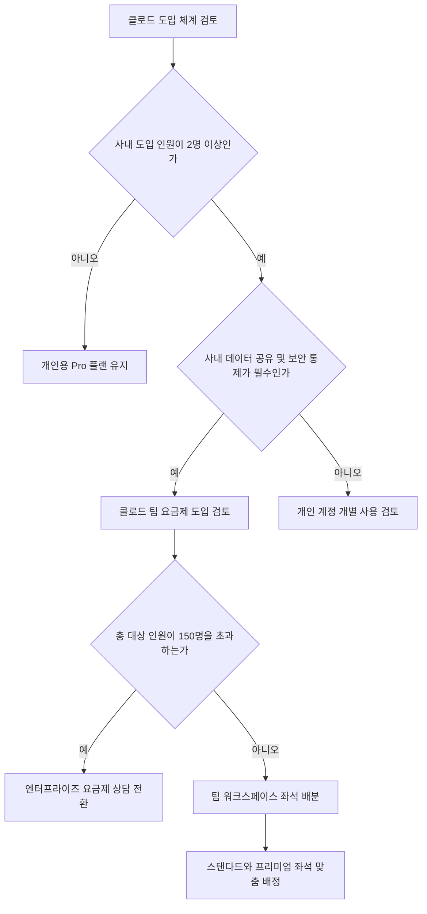

클로드 팀 요금제 가격은 연간 결제 시 1인당 월 20달러, 월간 결제 시 1인당 월 25달러로 책정되어 있습니다.

개인용 유료 플랜을 각자 쓰던 조직이 팀 플랜으로 전환을 고민할 때 가장 먼저 맞닥뜨리는 질문은 추가 비용에 걸맞은 관리 효율과 보안 가치가 실제로 존재하는가입니다. 단순히 여럿이 결제를 묶는 수준에 그치는지, 아니면 업무 생산성과 정보 보안 체계를 근본적으로 바꿔 놓는지 꼼꼼하게 따져보아야 합니다. 이 글에서는 팀 플랜의 정확한 요금 구조, 사용량 한도 정책, 외부 협업 도구 연동, 관리자 통제 기능까지 확인된 사실만을 바탕으로 명쾌하게 정리해 드립니다.

> **먼저 알아둘 용어**
>
> - **컨텍스트 윈도우**: AI가 한 번에 읽고 기억할 수 있는 글의 최대 길이입니다. 이 길이를 넘으면 앞부분을 잊습니다.
> - **프롬프트**: AI에게 건네는 지시문입니다. 같은 모델도 지시문에 따라 결과가 크게 달라집니다.
{: .prompt-info }

## 클로드 팀 요금제 가격 체계와 좌석 배정 구조

클로드 팀 요금제 가격은 결제 주기에 따라 1인당 월 20달러 또는 월 25달러로 나뉩니다.

스탠다드 좌석을 기준으로 연간 결제를 선택하면 1인당 월 20달러가 청구되며, 매월 결제하는 방식을 선택하면 1인당 월 25달러가 부과됩니다. 일 년 단위로 계약 기간을 확정하면 매달 인당 5달러씩 구독료를 절감할 수 있는 셈입니다. 팀 플랜은 개별 직원이 각자 카드로 결제하던 번거로움을 없애고 단일 워크스페이스(온라인 협업 작업 공간) 안에서 조직 전체의 계정을 묶어 관리하도록 돕습니다. 지원 가능한 최대 규모는 150석(seats)까지로 제한되어 있습니다. 따라서 사내 구성원이 150명을 넘어서는 대규모 기업이라면 팀 플랜을 그대로 쓸 수 없으며, 엔터프라이즈 요금제로 업그레이드 계약을 진행해야 합니다.

좌석을 배정할 때도 획일적인 단일 구성을 강제하지 않습니다. 동일한 팀 워크스페이스 안에서 구성원의 실제 업무 성격과 필요에 따라 스탠다드 좌석과 프리미엄 좌석을 유연하게 조합하여 배정할 수 있습니다. 텍스트 교정이나 정형화된 보고서 초안 작성처럼 기본적인 업무를 주로 수행하는 일반 실무자에게는 스탠다드 좌석을 배정하면 충분합니다. 반면 고난도 소프트웨어 개발이나 방대한 데이터 분석을 상시 진행하는 전문 엔지니어에게는 프리미엄 좌석을 지정하는 방식으로 예산 낭비를 막을 수 있습니다. 모든 인원에게 고비용 좌석을 일괄 적용할 필요 없이 부서별 업무 강도에 맞춰 소프트웨어 구독 지출을 정밀하게 통제할 수 있습니다.

다만 결제 단계에서 몇 가지 주의할 지점이 있습니다. 한국 사용자가 해외 결제 카드로 결제할 때 카드사 수수료나 10% 부가가치세가 최종 청구 금액에 어떻게 반영되는지는 실시간 환율과 카드사 정책에 따라 차이가 있을 수 있으므로 재무 부서의 결제 정책 확인이 필요합니다. 또한 계정 생성 경로에 따른 최소 좌석 요구 기준의 세부적인 정책 현황 역시 가입 시점의 공식 안내 화면을 확인해야 합니다. 연간 결제는 장기적인 비용 절감에 유리하지만 한 번 결제하면 계약 기간 도중 쉽게 해지하거나 환불하기 어렵다는 점도 미리 염두에 두어야 합니다. 따라서 도입 초기에는 부서별 실제 활용률을 면밀하게 측정한 뒤 결제 방식을 확정하는 절차가 권장됩니다.

```chartjs
{
  "type": "bar",
  "data": {
    "labels": ["팀 스탠다드 연간 결제", "팀 스탠다드 월간 결제"],
    "datasets": [{
      "label": "1인당 월 요금 달러",
      "data": [20, 25],
      "backgroundColor": ["#2f9e8f", "#1d6f63"]
    }]
  },
  "options": {
    "responsive": true
  }
}
```

결국 팀 요금제의 핵심은 인원 규모와 업무 성격에 따른 유연한 좌석 배치에 있습니다. 무조건 전체 인원을 한꺼번에 전환하기보다는 핵심 협업 부서를 중심으로 스탠다드 좌석과 프리미엄 좌석의 수요를 먼저 나누는 작업이 선행되어야 불필요한 예산 낭비를 방지할 수 있습니다.

## 클로드 팀 요금제 사용량 한도와 실무 협업 기능 비교

클로드 팀 요금제 사용량 한도는 전체 조직 공용 풀 방식이 아니라 각 좌석별로 독립적으로 부여됩니다.

일부 기업용 소프트웨어는 회사 전체에 하나의 통합 사용량을 제공합니다. 이 경우 특정 부서나 소수의 헤비 유저가 오전에 대용량 질의를 집중적으로 쏟아부으면 오후에는 다른 팀원들의 사용량이 모두 소진되어 업무가 전면 중단되는 불상사가 생깁니다. 반면 클로드 팀 플랜은 멤버별 좌석마다 개별 한도가 완벽하게 분리되어 작동합니다. 기본적으로 5시간 세션 한도가 작동하며, 고정된 주간 리셋 주기가 적용되므로 특정 동료의 과도한 사용이 다른 팀원의 일상 업무에 전혀 부정적인 영향을 미치지 않습니다. 각자가 독립적인 할당량을 보장받기 때문에 상호 간섭 없이 계획적으로 일과를 분배할 수 있습니다.

만약 주요 프로젝트 마감이나 분기 결산으로 인해 할당된 기본 사용량 한도에 일시적으로 도달하더라도 작업을 멈출 필요가 없습니다. 팀 플랜 사용자는 플랜 기본 한도에 도달하더라도 작업을 계속 이어갈 수 있도록 추가 사용량 크레딧을 사전에 구매할 수 있는 옵션이 제공됩니다. 중요한 프레젠테이션 문서 작성이나 소프트웨어 배포 직전에 사용량이 묶여 일정이 지연되는 비상 상황을 예방할 수 있는 안전장치입니다. 사내 관리자는 프로젝트 일정에 맞춰 필요한 만큼의 크레딧을 사전 충전해 두고 병목 현상을 방지할 수 있습니다.

기능 측면에서는 개인용 Pro 플랜이 가진 모든 기능을 전 좌석에 빠짐없이 지원합니다. 모든 최신 모델에 자유롭게 접근할 수 있으며, 200k 토큰(AI가 한 번에 읽고 기억하는 문맥 처리 단위로 수백 페이지에 달하는 책 한 권 분량의 텍스트)에 달하는 대용량 컨텍스트 윈도우를 기본으로 다룹니다. 부서 내에서 축적된 업무 노하우와 참고 문서를 한곳에 모아두는 프로젝트 기능도 포함됩니다. 여기에 더해 개발자의 코딩 작업을 돕는 클로드 코드와 협업 환경을 지원하는 클로드 코워크 접근 권한이 전 좌석에 기본 부여됩니다. 또한 구글 드라이브, 지메일, 구글 캘린더, 깃허브, 마이크로소프트 365, 슬랙 등 현업에서 널리 쓰이는 외부 업무 도구를 직접 연결하는 전용 커넥터와 사내 자료를 통합 검색하는 지식 검색 기능까지 결합되어 업무 도구 간의 단절을 완전히 해소합니다.

| 비교 항목 | 개인용 Pro 플랜 | 클로드 팀 플랜 |
| :--- | :--- | :--- |
| 1인당 월 요금 | 월 $20 | 연간 결제 시 월 $20, 월간 결제 시 월 $25 |
| 지원 가능 규모 | 1인 단독 계정 | 최대 150석 (150석 초과 시 엔터프라이즈) |
| 사용량 한도 배정 | 단독 개인 한도 | 좌석별 독립 한도, 5시간 세션, 주간 리셋, 추가 크레딧 구매 |
| 모델 및 문맥 길이 | 전체 모델 접근, 200k 토큰 | 전체 모델 접근, 200k 토큰 |
| 개발 및 협업 권한 | 프로젝트 기능 | 프로젝트, 클로드 코드, 클로드 코워크 |
| 외부 업무 도구 연동 | 미지원 | 구글 드라이브, 지메일, 캘린더, 깃허브, M365, 슬랙 커넥터 지원 |
| 사내 지식 검색 | 미지원 | 조직 내 통합 지식 검색 지원 |
| 데이터 학습 배제 | 일반 기본 방침 | 데이터 처리 추가 계약(DPA) 적용 및 모델 학습 기본 배제 |

## 관리자 통제 권한과 엔터프라이즈급 보안 정책

클로드 팀 플랜은 기업 내부 데이터와 프롬프트 대화 내용이 AI 모델 학습에 사용되지 않도록 기본 차단합니다.

기업이 생성형 AI를 실무에 도입할 때 정보보호 부서가 가장 엄격하게 따지는 조건은 기밀 유출 방지입니다. 무료 서비스나 개인 계정 환경에서는 직원이 입력한 사내 소스 코드, 재무 기획서, 고객 정보가 인공지능 모델의 성능 개선 학습용 데이터로 재활용될 위험이 상존합니다. 클로드 팀 플랜은 데이터 처리 추가 계약(DPA)이 표준으로 적용됩니다. 이를 통해 워크스페이스 내에서 구성원이 주고받은 모든 프롬프트 질의와 첨부 문서 데이터가 앤트로픽의 인공지능 모델 학습에 원천적으로 배제됩니다. 사내 중요 자산이 외부에 노출되거나 타사 서비스 학습에 섞여 들어갈 걱정 없이 안심하고 사용할 수 있는 안전판이 마련되는 셈입니다.

IT 보안 관리자를 위한 통제 기능도 체계적으로 갖추어져 있습니다. 청구서가 여러 카드로 쪼개지지 않고 법인 결제로 일원화되는 중앙 집중식 청구 관리 기능을 지원합니다. 특히 관리자는 조직 전체는 물론 개별 사용자별로 지출 한도를 지정하는 지출 통제 기능을 적극적으로 활용할 수 있습니다. 특정 팀원이 불필요하게 많은 추가 크레딧을 소진하여 소프트웨어 예산이 초과되는 사태를 시스템 차원에서 예방할 수 있습니다. 비용 한도를 실무자 직급이나 프로젝트 예산에 맞게 통제할 수 있으므로 재무 부서의 감사와 관리 부담이 획기적으로 줄어듭니다.

계정 접근 보안 체계 역시 기업 표준에 철저히 부합합니다. 사내 통합 계정으로 로그인하는 싱글사인온(SSO)을 지원하여 무분별한 비밀번호 분실이나 외부 해킹 위협을 방지합니다. 여기에 회사가 소유한 공식 이메일 도메인으로 가입하는 직원을 감지하여 통제권 안으로 끌어오는 도메인 캡처 기능이 탑재되어 있습니다. 새로 입사한 직원이 시스템에 로그인하는 즉시 계정을 자동 생성해 배정하는 JIT(Just-in-Time) 프로비저닝도 지원합니다. 또한 조직 내 직책과 업무 권한에 따라 읽기, 편집, 관리 권한을 세밀하게 분리하는 역할 기반 권한 제어(RBAC)를 통해 인가되지 않은 인원의 기밀 문서 접근을 원천 차단합니다.

이러한 강력한 보안과 관리자 제어 기능은 보안 규정이 까다로운 기업에서도 AI 도구를 제도권 안으로 수용할 수 있는 명확한 근거가 됩니다. 개인 카드로 음성 결제하여 사용하던 그림자 IT 환경을 청산하고, 회사의 공식 통제 아래에서 모든 AI 질의와 도구 연동을 투명하게 운영할 수 있습니다.

## 그래서 내 업무에는 뭐가 달라지나

클로드 팀 요금제는 흩어져 있던 개인의 작업 결과물을 팀 전체의 영구적인 자산으로 축적하는 환경을 만듭니다.

지금까지 직원들이 각자 개인 계정을 유료 결제해 썼다면, 어떤 직원이 뛰어난 결과물을 내더라도 그 프롬프트와 지식은 그 사람의 계정 안에만 갇혀 있었습니다. 팀 플랜에서는 프로젝트 기능을 중심으로 공용 문서와 맞춤형 지시문을 사전에 등록해 둘 수 있습니다. 새로 합류한 동료나 협업 중인 파트너가 동일한 지식 기반 위에서 일관된 양식의 보고서를 즉시 작성할 수 있습니다. 또한 슬랙 채널 대화, 지메일 서신, 깃허브 코드 저장소, 구글 드라이브나 마이크로소프트 365 클라우드 문서를 커넥터로 직접 연결하여 통합 검색할 수 있으므로, 매번 창을 옮겨 다니며 파일을 다운로드하고 다시 업로드하던 불필요한 반복 작업이 완전히 사라집니다.



조직의 효율적인 업무 환경 구축을 위해 오늘 즉시 실행해야 할 세 가지 구체적인 행동은 다음과 같습니다.

첫째, 사내에서 개인 카드로 생성형 AI 유료 구독을 결제하고 비용을 청구 중인 인원 현황을 즉각 파악하십시오. 개별 영수증 정산에 소모되던 회계 처리 행정 비용을 즉시 절감하고, 회사 데이터가 무방비로 개인 계정에 저장되는 위험을 차단하는 첫걸음입니다.

둘째, 도입 대상 팀원들의 실제 업무 성격을 분석하여 스탠다드 좌석과 프리미엄 좌석의 배정 비율을 설정하십시오. 일상적인 텍스트 요약과 커뮤니케이션 지원이 주를 이루는 일반 부서에는 스탠다드 좌석을 배정하고, 복잡한 코드 작성과 실시간 대용량 분석을 전담하는 전문 개발팀에만 프리미엄 좌석을 지정하여 전체 구독 비용을 최적화하십시오.

셋째, 팀의 연간 활용 계획에 맞춰 결제 방식을 결정하십시오. 향후 1년 이상 전사적 도구로 정착시킬 계획이 확정된 조직이라면 연간 결제를 선택하여 1인당 월 5달러의 구독료를 아끼십시오. 만약 실무 부서의 효과 검증이 먼저 필요한 파일럿 단계라면 월간 결제 방식으로 시작하여 효용성을 확인한 뒤 전환 계약을 맺으십시오. 더불어 대상 인원이 150명을 넘어서는지 확인하여 필요시 엔터프라이즈 전환을 준비하십시오.

<!-- internal-links:start -->
## 함께 읽으면 이해가 이어지는 글

- [여러 AI 에이전트 로그를 한 화면에서 봐도 될까? Kibitz의 출처, 요약 점검]() — 여러 터미널 세션을 모으고 로그를 서사형 상태로 요약한다는 Kibitz의 장점과, 이름이 같은 저장소가 섞인 원문에서 먼저 확인할 출처, 기능 경계를 짚습니다.
- [everything-claude-code를 팀에 도입할까: 역할 분리, 스킬, 훅의 비용]() — everything-claude-code의 역할별 에이전트, 필요할 때 불러오는 스킬, 훅 기반 기록 구조를 살펴보고 컨텍스트, 권한, 비용, 팀 설정의 도입 기준을 정리합니다.
- [Claude-HUD는 무엇을 보여 주나? Statusline, Transcript 구조와 도입 기준]() — Claude Code의 공식 statusline 입력과 transcript를 이용해 컨텍스트, 도구, 에이전트 상태를 표시하는 Claude-HUD의 구조, 보안 경계와 성능, 운영 검증법을 설명합니다.
<!-- internal-links:end -->

## 자주 묻는 질문

### 클로드 팀 요금제에서 팀원들이 사용량 한도를 함께 나누어 쓰나요?

아닙니다. 클로드 팀 플랜의 사용량 한도는 전체 조직 공용 풀 방식이 아니라 각 좌석별로 독립적으로 부여됩니다. 5시간 단위 세션 한도와 주간 리셋 주기가 멤버마다 개별 적용되므로 특정 동료가 작업을 많이 하더라도 다른 팀원의 사용 한도가 줄어들지 않습니다.

### 업무 마감 직전에 기본 사용량 한도에 도달하면 어떻게 대처하나요?

팀 플랜 사용자는 플랜 기본 한도에 도달하더라도 작업을 계속 이어갈 수 있도록 추가 사용량 크레딧을 사전에 구매할 수 있는 옵션이 제공됩니다. 이를 통해 마감 작업이나 긴급한 프로젝트 진행 중 서비스가 차단되는 위험을 방지할 수 있습니다.

### 사내 워크스페이스에 입력한 기업 기밀 데이터가 인공지능 모델 학습에 쓰이나요?

쓰이지 않습니다. 클로드 팀 플랜에는 데이터 처리 추가 계약(DPA)이 적용되어 기업 내부 데이터 및 프롬프트 대화 내용이 앤트로픽의 인공지능 모델 학습에 기본적으로 사용되지 않으므로 안심하고 실무에 활용할 수 있습니다.

### 조직 구성원이 150명을 초과하는 대규모 기업도 팀 요금제를 쓸 수 있나요?

쓸 수 없습니다. 클로드 팀 플랜은 최대 150석까지만 지원합니다. 조직 구성원이 150석을 초과하는 대규모 조직의 경우에는 엔터프라이즈 요금제로 업그레이드하여 별도 계약을 진행해야 합니다.

## 직접 확인한 원문

- [Claude Help Center (What is the Team plan?)](https://support.claude.com/en/articles/9266767-what-is-the-team-plan) (2026-09-20 확인)
- [Claude Help Center (How do usage and length limits work?)](https://support.claude.com/en/articles/11647753-how-do-usage-and-length-limits-work) (2026-09-20 확인)
- [Kevin Welter (Claude Team: Cost and When It Pays Off)](https://kevinwelter.com/en/blog/claude-team) (2026-09-20 확인)

위 수치는 확인 시점 기준이며 예고 없이 바뀔 수 있습니다. 결정 전에 공식 페이지를 한 번 더 확인하시기 바랍니다.
