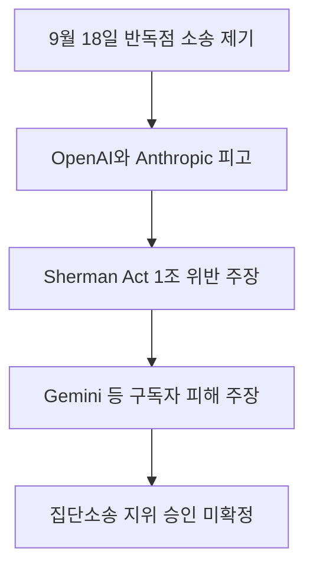

2026년 9월 18일 네 명의 유료 소비자가 OpenAI, Anthropic, SpaceXAI, Google을 상대로 연방 법원에 반독점 소송을 제기했습니다 <a href="#source-1" aria-label="미국 캘리포니아 북부 연방지방법원 출처">[1]</a>. 매달 구독료를 지불하는 사용자 입장에서 기업들이 서로 손을 잡고 모델 발전 속도를 늦추기로 담합했다면 이는 소비자가 마땅히 누려야 할 권리를 침해한 행위라는 주장입니다 <a href="#source-3" aria-label="Unite.AI 출처">[3]</a>. 이번 소송은 주요 인공지능 연구소들이 내세우는 안전 목적의 속도 조절이 법정에서 불법적인 시장 담합으로 해석될 수 있는지 가늠하는 첫 공식 시험대가 되었습니다.

> **먼저 알아둘 용어**
>
> - **프롬프트**: AI에게 건네는 지시문입니다. 같은 모델도 지시문에 따라 결과가 크게 달라집니다.
{: .prompt-info }

## 무슨 일이 벌어진 걸까?

네 명의 소비자는 2026년 9월 18일 미국 캘리포니아 북부 연방지방법원에 정식으로 집단소송 소장을 제출했습니다 <a href="#source-1" aria-label="미국 캘리포니아 북부 연방지방법원 출처">[1]</a>. 사건 명칭은 Buist et al v. Anthropic PBC et al입니다 <a href="#source-1" aria-label="미국 캘리포니아 북부 연방지방법원 출처">[1]</a>. 소장에 피고로 이름을 올린 법인은 Anthropic PBC, OpenAI OpCo LLC, SpaceXAI LLC, Google LLC 등 네 곳의 핵심 기술 기업입니다 <a href="#source-1" aria-label="미국 캘리포니아 북부 연방지방법원 출처">[1]</a>.

원고들이 문제 삼은 핵심 법률은 바로 미국 경쟁법의 근간인 Sherman Act 제1조입니다 <a href="#source-3" aria-label="Unite.AI 출처">[3]</a>. Sherman Act(미국의 독점금지법) 제1조는 시장 경쟁을 제한하는 기업 간 부당한 합의나 결탁을 엄격하게 금지하고 있습니다. 소송을 낸 소비자들은 인공지능 시장에서 치열하게 경쟁해야 할 피고 기업들이 상호 협약을 맺고 프론티어 AI(가장 앞선 성능을 지닌 최첨단 모델)의 개발 속도를 인위적으로 늦추기로 합의했다고 주장합니다 <a href="#source-3" aria-label="Unite.AI 출처">[3]</a>.

소송을 제기한 원고 네 명은 각각 ChatGPT, Claude, Grok, Gemini의 유료 서비스를 이용 중인 실제 구독자들입니다 <a href="#source-3" aria-label="Unite.AI 출처">[3]</a>. 이들은 매달 일정 금액의 구독료를 지불하면서 제품의 지속적인 기술 개선과 기능 업그레이드를 기대해 왔습니다. 하지만 피고 기업들이 서로 약속하고 모델 출시 속도를 늦추면 시장의 공급이 제한되고 혁신 속도가 억제됩니다. 소장에서는 이러한 행위가 **소비자 유료 구독 서비스의 실질적인 가치를 떨어뜨리는 불법적인 산출량 제한 조치**에 해당한다고 명시했습니다 <a href="#source-3" aria-label="Unite.AI 출처">[3]</a>.

여기서 주목할 점은 원고들이 기업의 자발적인 안전 연구 자체를 반대하는 것은 아니라는 사실입니다. 원고들은 개별 기업이 독자적인 판단과 내부 기준에 따라 모델 출시를 미루거나 안전 검증을 강화하는 독립적인 속도 조절에 대해서는 전혀 이의를 제기하지 않는다고 소장에 직접 밝혔습니다 <a href="#source-3" aria-label="Unite.AI 출처">[3]</a>. 즉 한 회사가 스스로 내린 안전 결정은 존중받아야 하지만 경쟁사들이 공공연하게 보조를 맞추며 시장 전체의 발전 속도를 조절하기로 합의하는 것은 공정한 시장 질서를 무너뜨리는 불법 카르텔이라는 지적입니다.

결국 이번 소송은 경쟁 관계에 있는 기술 기업들이 공적인 담론을 매개로 개발 속도를 협의하는 행위가 합법적인 안전 추구인지 아니면 독점금지법이 금지하는 경쟁 제한 담합인지 가려내는 매우 중요한 법적 분기점이 되고 있습니다.

<figure class="news-source-image">
  
  <figcaption>Unite.AI가 원문과 함께 공개한 이미지입니다. <a href="https://www.unite.ai/consumers-sue-anthropic-openai-spacexai-and-google-over-alleged-ai-pact" target="_blank" rel="noopener noreferrer">출처: Unite.AI</a></figcaption>
</figure>

## 왜 지금 다들 이 이야기를 할까?

이번 법적 분쟁의 직접적인 계기는 2026년 9월 12일 주요 기술 기업 대표들이 보여준 연쇄적인 공개 선언이었습니다 <a href="#source-3" aria-label="Unite.AI 출처">[3]</a>. Anthropic의 CEO Dario Amodei는 2026년 9월 12일 최첨단 기술이 초래할 수 있는 잠재적 위험에 대응하기 위해 업계 전반의 개발 속도 조절이 필요하다는 내용의 에세이를 공식 발표했습니다 <a href="#source-3" aria-label="Unite.AI 출처">[3]</a>. 위험 요소를 충분히 검증하기 전까지는 개별 기업 간의 과도한 속도 경쟁을 자제하자는 제안이었습니다.

놀라운 점은 이 제안이 공개되자마자 경쟁 관계에 있던 다른 대표들이 즉각 호응했다는 사실입니다. 같은 날인 2026년 9월 12일 OpenAI CEO Sam Altman, SpaceXAI 대표 Elon Musk, Google DeepMind 공동 창업자 Demis Hassabis가 Dario Amodei의 글에 대해 공개적인 지지 의사를 밝혔습니다 <a href="#source-3" aria-label="Unite.AI 출처">[3]</a>. 시장에서 가장 치열하게 맞서던 네 곳의 핵심 리더들이 불과 하루 만에 한목소리로 개발 속도 조절에 뜻을 모은 것입니다.

이 광경을 지켜본 유료 이용자들의 시선은 매우 차가웠습니다. 소비자들은 기업 대표들이 안전이라는 명분을 내세워 사실상 **신제품 출시 지연과 성능 제약을 사전에 합의한 불법 담합**을 형성했다고 판단했습니다 <a href="#source-3" aria-label="Unite.AI 출처">[3]</a>. 기업들이 서로 속도 경쟁을 멈추기로 약속한다면 유료 구독자는 계속 비용을 지불하면서도 더 발전된 인공지능 모델을 제때 이용할 기회를 박탈당하기 때문입니다.

주요 피고 기업들과 관련 대표 인물, 그리고 이들이 서비스 중인 대표 제품의 관계는 아래 표와 같이 정리할 수 있습니다.

| 기업 법인명 | 소송 관련 주요 인물 | 구독 서비스 대표 제품 |
| :--- | :--- | :--- |
| Anthropic PBC | Dario Amodei | Claude |
| OpenAI OpCo LLC | Sam Altman | ChatGPT |
| SpaceXAI LLC | Elon Musk | Grok |
| Google LLC | Demis Hassabis | Gemini |

해당 기업들은 전 세계 생성형 모델 시장을 사실상 이끌고 있는 대표 연구소들입니다. 이처럼 강력한 시장 영향력을 지닌 기업들이 한날한시에 보조를 맞추겠다고 선언하자 소비자들은 즉각 법의 심판을 요구하며 법원으로 향했습니다. 기업들이 자율적으로 추진해 온 안전 연대가 반독점법이라는 강력한 규제 법률과 정면으로 충돌한 순간이었습니다.

## 그래서 우리에게 뭐가 달라질까?

유료 구독 서비스를 이용하는 실무자와 일반 사용자에게 이번 소송은 매달 결제하는 서비스의 미래 기능과 직결됩니다. 만약 기업들이 속도 조절이라는 명분 아래 새로운 모델의 배포 일정을 늦춘다면 유료 구독자는 동일한 비용을 내면서도 개선된 기능을 제때 경험하지 못하게 됩니다. 매달 갱신되는 정기 결제 환경에서 기술 진보의 속도가 둔화되면 사용자가 얻을 수 있는 업무 효율성 역시 정체될 수밖에 없습니다.

예를 들어 일상 업무에서 글 작성이나 데이터 분석을 위해 상용 서비스를 유료로 구독하는 직장인이라면 신규 기능의 도입 지연을 즉각 느끼게 됩니다. 본래 정상적인 시장 경쟁 구도였다면 더 빠르게 적용되었을 고도화된 기능들이 연구소 간의 협약으로 인해 출시가 늦춰질 수 있기 때문입니다. 이는 소비자가 서비스 이용 대가로 지불한 비용에 비해 충분한 혜택을 돌려받지 못하는 결과로 이어집니다.

기업 간의 전략적 역학 관계도 크게 흔들리고 있습니다. 그동안 연구소들은 파괴적인 인공지능 경쟁을 막기 위해 업계 차원의 자발적 안전 약속이 필수적이라고 주장해 왔습니다. 하지만 이번 소송을 통해 경쟁사 간에 공공연하게 개발 속도를 맞추는 행위가 **Sherman Act 제1조를 위반한 반독점 담합 행위로 법적 처벌 대상이 될 수 있다**는 위험성을 명확히 드러냈습니다 <a href="#source-3" aria-label="Unite.AI 출처">[3]</a>.

법원의 심리 결과에 따라 향후 기업들의 신제품 출시 정책도 완전히 달라질 수 있습니다. 만약 법원이 소비자들의 문제 제기를 타당하다고 인정한다면 기업들은 다른 연구소와 개발 일정을 조율할 수 없게 되며 다시 치열한 단독 출시 경쟁에 돌입해야 합니다. 반대로 법원이 이러한 공개 지지를 정당한 안전 활동의 일환으로 판단한다면 업계 전반의 모델 출시 주기는 지금보다 한층 완만한 흐름을 이어가게 될 것입니다.

<figure class="news-source-image">
  
  <figcaption>Unite.AI가 원문과 함께 공개한 이미지입니다. <a href="https://www.unite.ai/consumers-sue-anthropic-openai-spacexai-and-google-over-alleged-ai-pact" target="_blank" rel="noopener noreferrer">출처: Unite.AI</a></figcaption>
</figure>

## 그래서 내 업무에는 뭐가 달라지나

지금 시점에서 유료 인공지능 서비스를 활용해 업무를 처리하는 실무자와 개인 구독자가 취할 수 있는 구체적인 행동은 다음과 같습니다. 기업들의 법적 공방을 막연하게 바라보기보다는 현재의 지출 구조와 작업 환경을 현실적으로 점검하는 조치가 필요합니다.

먼저 자신이 매달 정기 결제하고 있는 ChatGPT, Claude, Grok, Gemini 등 유료 구독 서비스의 목록을 직접 확인해야 합니다. 여러 개의 서비스를 관성적으로 결제해 두고 있다면 업무상 실제로 빈번하게 활용하는 핵심 도구만 남기고 과감히 정리하는 지출 점검을 실행해야 합니다. 기업 간의 속도 조절 논란으로 인해 단기간 내에 획기적인 기능 향상이 둔화될 가능성이 있다면 중복으로 나가는 구독료 지출을 줄이는 것이 가장 현실적인 대응입니다.

다음으로 특정 단일 인공지능 서비스에만 의존하던 업무 방식을 다양하게 분산해야 합니다. 특정 회사의 모델 개발과 배포 주기가 지연되더라도 다른 경쟁사 제품이나 자체적인 작업 환경을 통해 대체할 수 있도록 준비해 두어야 합니다. 주력으로 사용하는 도구의 업데이트가 늦춰졌을 때 즉시 업무를 이어갈 수 있도록 범용적인 작업 프롬프트와 작업 양식을 별도로 정리해 두는 작업이 유용합니다.

마지막으로 각 기업이 공식 웹사이트나 서비스 안내를 통해 발표하는 신규 모델 로드맵을 수시로 검토해야 합니다. 소송 과정에서 피고 기업들이 기존에 제시했던 제품 출시 일정을 연기하거나 기능 업데이트 주기를 변경하는지 공식 공지 사항을 직접 확인하며 업무용 소프트웨어 도입 일정을 조정해야 합니다.

## 아직은 선을 그어야 할 부분

이번 사건은 이제 막 소장이 접수된 초기 단계이므로 최종적인 결과를 섣불리 단정해서는 안 됩니다. 현재 미국 캘리포니아 북부 연방지방법원에 소송이 제기된 것은 사실이지만, 법원이 유료 구독자 전체를 대리하는 전국 단위 집단소송 지위를 정식으로 승인했는지는 아직 결정되지 않았습니다.

아울러 기업 대표들이 나눈 공개 발언이 실제 법률 위반으로 확정된 것도 아닙니다. 2026년 9월 12일에 오간 에세이 발표와 소셜 미디어상의 지지 표명이 **Sherman Act 제1조가 금지하는 구체적이고 불법적인 수평적 담합 합의로 인정될 수 있는지 여부**는 법원이 본안 재판을 통해 면밀히 따져보아야 할 영역입니다 <a href="#source-3" aria-label="Unite.AI 출처">[3]</a>. 법원은 아직 해당 사건의 본안에 대한 판결을 내리지 않았습니다.

피고 기업들의 공식적인 법적 방어 논리 역시 계속 지켜보아야 할 대목입니다. Anthropic PBC, OpenAI OpCo LLC, SpaceXAI LLC, Google LLC 측 대변인들은 언론의 즉각적인 논평 요청에 공식 입장을 밝히지 않았습니다 <a href="#source-3" aria-label="Unite.AI 출처">[3]</a>. 향후 피고 기업들이 법정에 제출할 공식 답변서를 통해 이번 공개 발언을 독립적인 안전 판단으로 어떻게 변론할지 차분히 확인하는 과정이 필요합니다.

<!-- primary-sources:start -->
## 원문과 버전 확인

- [발표 원문](https://www.pacermonitor.com/public/case/66884670/Buist_et_al_v_Anthropic,_PBC_et_al)
- [Associated Press](https://apnews.com/article/antitrust-lawsuit-ai-slowdown-anthropic-openai-spacexai-google-960af4308161eaf4ed13c383b0ce1c1b)
- [Unite.AI](https://www.unite.ai/consumers-sue-anthropic-openai-spacexai-and-google-over-alleged-ai-pact)
<!-- primary-sources:end -->

<!-- internal-links:start -->
## 함께 읽으면 이해가 이어지는 글

- [OpenAI와 Anthropic 등 AI 연구자 1,100명 속도 조절 공개 서한 'Pacing the Frontier' 발표]() — 2026년 7월 28일, OpenAI, Anthropic, Google DeepMind, Meta 등 주요 AI 기업 연구자 1,100여 명이 AI 개발 속도를 제어하기 위한 정부 지원을 요청하는 공개 서한 'Pacing the…
- [Anthropic과 OpenAI 및 Musk 연대, 프론티어 AI 개발 속도 의도적 감속 제안]() — Anthropic 대표 Dario Amodei가 2026년 9월 12일 최고 성능 AI 개발 속도를 의도적으로 늦추자고 제안했습니다. OpenAI의 Sam Altman과 Elon Musk도 즉각 지지 의사를 밝혔습니다. 이들은 안전…
- [OpenAI 차세대 AI 모델 Astra 출시 준비와 사이버 위험 Critical 등급 지정]() — 2026년 9월 1일 OpenAI는 차세대 프론티어 모델 Astra의 보안 평가 결과를 담은 문서를 공개했습니다. Astra는 OpenAI 모델 가운데 최초로 준비태스크 체계 기준 사이버보안 역량 최고 위험 수준인 Critical…
<!-- internal-links:end -->

## 자주 묻는 질문

### 이번 반독점 소송의 피고로 적시된 기업은 어디인가요?

소장에 피고로 적시된 법인은 Anthropic PBC, OpenAI OpCo LLC, SpaceXAI LLC, Google LLC 등 네 곳입니다.

### 소송을 제기한 유료 구독자들의 핵심 주장은 무엇인가요?

원고들은 피고 기업들이 개발 속도를 늦추기로 담합하여 제품 개선을 지연시켰고, 이것이 산출량 제한에 해당하여 자신들이 지불하는 유료 구독 서비스의 가치를 떨어뜨렸다고 주장합니다.

### 개별 기업이 자체적으로 속도를 조절하는 것도 소송 대상인가요?

아닙니다. 원고들은 개별 회사가 독자적으로 결정하는 안전 조치나 개발 속도 조절에 대해서는 이의를 제기하지 않는다고 소장에 명시했습니다.

### 법원에서 전국 단위 집단소송 지위가 이미 확정되었나요?

아직 확정되지 않았습니다. 현재 소장이 접수된 상태이며, 법원은 집단소송 승인 여부와 Sherman Act 위반 여부에 대해 본안 판결을 내리지 않았습니다.

## 직접 확인한 원문

<ol class="checked-source-list">
  <li id="source-1"><a href="https://www.pacermonitor.com/public/case/66884670/Buist_et_al_v_Anthropic,_PBC_et_al" target="_blank" rel="noopener noreferrer">U.S. District Court for the Northern District of California — Buist et al v. Anthropic, PBC et al (Case No. 3:26-cv-10693)</a> (2026-09-18)</li>
  <li id="source-2"><a href="https://apnews.com/article/antitrust-lawsuit-ai-slowdown-anthropic-openai-spacexai-google-960af4308161eaf4ed13c383b0ce1c1b" target="_blank" rel="noopener noreferrer">Associated Press — Lawsuit says Anthropic, OpenAI, SpaceXAI and Google made illegal agreement on AI slowdown</a> (2026-09-19)</li>
  <li id="source-3"><a href="https://www.unite.ai/consumers-sue-anthropic-openai-spacexai-and-google-over-alleged-ai-pact" target="_blank" rel="noopener noreferrer">Unite.AI — Consumers Sue Anthropic, OpenAI, SpaceXAI and Google Over Alleged AI Pact</a> (2026-09-19)</li>
</ol>

> 이 글은 위 원문을 직접 확인해 작성했습니다. 가격, 기능 범위, 지역별 제공 여부는 게시 후 바뀔 수 있으니 실제 도입 전 공식 문서를 다시 확인하세요.
