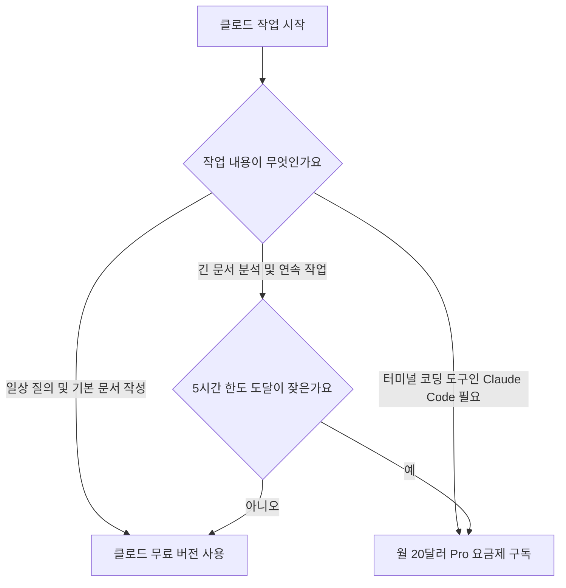

클로드 무료 요금제 사용량은 첫 질문을 전송한 시점부터 계산되는 5시간 단위 롤링 세션 한도를 따릅니다. 사용자가 보낼 수 있는 메시지 숫자가 매번 다른 이유는 고정된 횟수가 정해져 있지 않고 대화 길이와 실시간 서버 수요에 따라 전송 한도가 유동적으로 바뀌기 때문입니다. 이 글은 클로드 무료 요금제 제한 규칙과 토큰 소모 구조를 알기 쉽게 풀고, 비용을 들이지 않고 작업 효율을 지키는 기준을 명확하게 정리해 드립니다.



> **먼저 알아둘 용어**
>
> - **토큰**: AI가 글을 잘게 쪼개 세는 단위입니다. 한국어는 보통 한두 글자가 토큰 하나입니다.
> - **프롬프트**: AI에게 건네는 지시문입니다. 같은 모델도 지시문에 따라 결과가 크게 달라집니다.
> - **컨텍스트 윈도우**: AI가 한 번에 읽고 기억할 수 있는 글의 최대 길이입니다. 이 길이를 넘으면 앞부분을 잊습니다.
> - **API**: 다른 프로그램에서 이 기능을 불러다 쓸 수 있게 열어 둔 창구입니다.
> - **에이전트**: 사람이 단계마다 지시하지 않아도 스스로 여러 작업을 이어서 처리하는 AI입니다.
{: .prompt-info }

## 클로드 무료 요금제 제한과 5시간 롤링 세션의 작동 원리

클로드 무료 요금제 사용량은 매일 자정에 일괄 갱신되는 방식이 아니라 첫 프롬프트를 보낸 순간부터 5시간 동안 유지되는 롤링 세션 한도를 기준으로 작동합니다.

롤링 세션이란 사용자가 첫 번째 질문을 시스템에 입력해 대화를 시작한 시각을 기준으로 5시간 타이머가 돌아가는 사용량 관리 방식입니다. 한도에 도달해 대화가 멈추더라도 해당 5시간 주기가 끝나면 사용량이 다시 초기화됩니다. 많은 분이 클로드 무료 요금제 한도가 정확히 몇 개인지 궁금해합니다. 하지만 앤스로픽은 무료 사용자에게 제공하는 5시간당 구체적인 단일 메시지 상한 숫자를 공개하지 않았습니다. 전송 가능한 질문 횟수는 고정된 숫자가 아니기 때문입니다. 인공지능 서버에 접속한 전 세계 동시 이용자의 실시간 서버 수요와 사용자가 입력한 메시지의 글자 수, 첨부한 파일의 용량, 대화창 안에 누적된 이전 대화 맥락 길이에 따라 한도가 실시간으로 조정됩니다.

클로드 무료 요금제 토큰 소모 구조를 이해하면 한도가 왜 빨리 닳는지 파악할 수 있습니다. 토큰은 인공지능 모델이 인간의 언어를 인식하고 처리할 때 글자를 쪼개서 세는 최소 계산 단위입니다. 영어는 통상 한 단어가 1토큰 안팎이며 한국어는 보통 한 글자나 두 글자가 1토큰에 해당합니다. 클로드 대화창에 질문을 전송할 때 시스템은 방금 입력한 최신 문장 하나만 단독으로 읽는 것이 아닙니다. 하나의 대화창 안에 쌓여 있던 이전 질문과 답변 전체를 매번 새로운 입력 문맥으로 처음부터 다시 읽어 들입니다. 따라서 한 대화방에서 질문을 계속 이어가면 나중에 입력한 짧은 질문 한 줄조차 앞서 누적된 방대한 토큰 전체와 합산되어 전송됩니다. 이로 인해 세션 사용량이 급격히 갉아먹히고 몇 번 대화하지 않았는데도 한도 제한 경고를 받게 됩니다.

웹 주소를 입력해 기사나 자료를 읽어 오도록 명령하는 웹 페치 기능도 주의해서 다뤄야 합니다. 웹 페치는 인터넷 링크의 페이지 정보를 긁어와 분석해 주는 편의 기능입니다. 그러나 웹 링크를 그대로 전달하면 해당 웹 페이지에 담긴 전체 텍스트가 대화창의 컨텍스트 창 안으로 한꺼번에 입력됩니다. 그 결과 본문 텍스트와 주변 부가 정보가 대량의 토큰으로 전환되어 단 한두 번의 질의만으로 5시간 사용량 한도를 전부 소모하게 만듭니다. 긴 문서를 다룰 때는 링크를 통째로 넘기기보다 필요한 본문 문단만 직접 추려 짧게 나누어 넣어야 세션 중단을 방지할 수 있습니다.

## 무료 플랜에서 지원하는 핵심 기능과 프로젝트 관리법

클로드 무료 요금제 사용자에게도 2026년 출시된 주력 모델 Claude Sonnet 5와 함께 프로젝트, 메모리, 아티팩트 기능이 차별 없이 제공됩니다.

무료 계정이라고 해서 구형 모델이나 성능을 낮춘 저지능 인공지능으로 강등되지 않습니다. 2026년 출시된 주력 모델인 Claude Sonnet 5가 유료 플랜뿐만 아니라 무료 요금제에서도 기본 모델로 지정되어 작동합니다. 질문의 품질이나 복합 추론 능력, 글 작성 수준은 유료 사용자와 동일한 고성능 모델의 결과물로 받아볼 수 있습니다. 오직 세션당 전송할 수 있는 메시지 총량과 접속 우선순위에서만 차이가 날 뿐입니다. 따라서 일상적인 문서 작성이나 기획 업무에서는 무료 플랜만으로도 최상급 성능을 누릴 수 있습니다.

클로드 무료 버전 사용법 중 핵심은 프로젝트 기능의 활용에 있습니다. 프로젝트는 공통으로 참조할 문서나 지침을 미리 채워 두고 여러 대화방에서 공유해 쓰는 독립된 업무 폴더입니다. 클로드 무료 계정에서는 최대 5개까지 프로젝트를 생성할 수 있습니다. 무료 계정의 프로젝트 상한선이 5개로 정해져 있으므로 더 이상 쓰지 않는 프로젝트는 삭제하거나 통합하면서 슬롯을 관리해야 합니다. 프로젝트 안에 회사 소개서나 글쓰기 서식 같은 기본 자료를 채워 두면 매번 새 대화를 열 때마다 배경 정보를 길게 타이핑할 필요가 없어 불필요한 토큰 낭비를 줄여 줍니다.

인공지능이 사용자의 특성을 기억하는 메모리 기능도 무료 계정에서 기본으로 켜져 있습니다. 메모리는 사용자가 과거 대화에서 언급한 직업, 선호하는 문체, 자주 쓰는 서식 정보를 기억해 두었다가 다음 대화에 반영하는 기능입니다. 이 기능은 무료, Pro, Max 요금제 계정 모두에서 기본 활성화 상태로 제공되므로 번거로운 추가 설정이 필요 없습니다. 화면 오른쪽에 독립된 창을 열어 작성된 코드나 서식을 시각화해 보여주는 아티팩트 기능 역시 무료 플랜에서 동작합니다. 다만 아티팩트를 문제없이 구동하려면 계정 설정의 역량 메뉴에서 코드 실행과 파일 생성 옵션이 활성화되어 있는지 확인해야 합니다. 이 항목이 켜져 있어야 코드를 직접 돌려 보거나 문서 양식을 화면에서 실시간으로 검토할 수 있습니다.

| 비교 항목 | 클로드 무료 플랜 (Free) | 클로드 프로 플랜 (Pro) |
| :--- | :--- | :--- |
| 월 구독 비용 | 0달러 | 월 20달러 |
| 기본 적용 모델 | Claude Sonnet 5 | Claude Sonnet 5 |
| 5시간 세션 사용량 | 실시간 서버 트래픽과 토큰 양에 따른 유동적 제한 | 무료 대비 세션당 훨씬 높은 사용량 허용 |
| 프로젝트 생성 한도 | 최대 5개 프로젝트 | 제한 없는 다수 프로젝트 생성 |
| 메모리 기능 지원 여부 | 기본 활성화 (On) | 기본 활성화 (On) |
| 아티팩트(Artifacts) 지원 | 지원 (설정 내 역량 활성화 필요) | 지원 (설정 내 역량 활성화 필요) |
| 개발 도구 Claude Code | 접근 및 사용 불가 | 접근 권한 기본 제공 |
| 트래픽 폭주 시 처리 | 대기열 및 응답 지연 가능 | 우선 접속권 부여로 안정적 처리 |

## 그래서 내 업무에는 뭐가 달라지나

클로드 무료 요금제 사용량 제약을 피하고 한도 도달 없이 업무를 진행하려면 오늘부터 세 가지 작업 습관을 즉시 적용해야 합니다.

첫째, 대화창 하나에 여러 질문을 누적하지 말고 업무 주제가 바뀔 때마다 왼쪽 상단의 새 채팅을 누르세요. 과거 대화 내용이 길게 이어질수록 매 질문마다 이전 대화 전체가 토큰으로 중복 계산되어 전송됩니다. 이로 인해 질문 다섯 번 만에 5시간 한도에 도달하는 일이 발생합니다. 초안 작성, 교정 작업, 데이터 분석처럼 목적이 다르면 반드시 새 대화창을 열어 토큰 소모를 초기화해야 합니다. 대화창을 잘게 나누는 것만으로도 무료 요금제에서 하루 동안 처리할 수 있는 실제 업무 처리량이 체감될 정도로 늘어납니다.

둘째, 웹사이트 링크 전체를 넘기는 웹 페치 분석 대신 꼭 필요한 핵심 문단만 복사해서 프롬프트에 넣으세요. 인터넷 주소를 입력해 문서를 분석시키면 웹 페이지의 광고나 메뉴, 긴 부속 문장까지 대화창에 밀려 들어옵니다. 그 결과 수만 개의 토큰이 한꺼번에 소모되어 질문 한 번 만에 5시간 세션이 잠길 수 있습니다. 읽어야 할 기사나 자료가 있다면 사용자가 필요한 단락 세네 개만 직접 긁어다 질문 창에 붙여넣는 것이 세션 사용량을 지키는 확실한 방법입니다.

셋째, 반복되는 업무 양식과 지침은 최대 5개까지 생성 가능한 프로젝트 기능에 넣어 관리하세요. 이메일 톤앤매너나 정기 보고서 서식처럼 매번 되풀이해서 적던 설명을 프로젝트 내부 지침으로 등록하면 본문 질문을 간결하게 작성할 수 있습니다. 프롬프트 길이가 짧아질수록 세션당 질문할 수 있는 잔여 횟수가 늘어납니다. 또한 계정 설정의 역량 메뉴로 들어가 코드 실행과 파일 생성이 정상적으로 켜져 있는지 확인하세요. 아티팩트 창이 활성화되어 있어야 작성된 결과물을 별도 편집 프로그램 없이 깔끔하게 확인하고 업무에 활용할 수 있습니다. 반면 터미널 기반 개발 도구인 Claude Code를 써야 하거나 5시간 한도 대기 없이 연속 작업을 이어가야 하는 상황이라면 무료 유지를 고집하지 말고 월 20달러 Pro 요금제로 전환하는 것이 올바른 결정입니다.

## 유료 Pro 요금제와 개발자용 API 크레딧의 결정적 차이

웹 브라우저에서 쓰는 클로드 구독 서비스와 개발자 콘솔에서 쓰는 Claude API는 과금 구조와 대상이 완전히 분리된 별개의 체계입니다.

무료 사용자가 가장 먼저 고민하는 유료 전환 대상은 월 20달러의 Pro 요금제입니다. Pro 요금제는 웹 대화창 환경에서 무료 플랜 대비 세션당 훨씬 높은 사용량을 보장합니다. 이용자가 급증하는 특정 시간대에도 우선 접속권을 제공받아 응답 속도 저하나 접속 지연을 겪지 않습니다. 또한 터미널 환경에서 인공지능 에이전트 기능을 활용해 소프트웨어를 제작하고 디버깅하는 전용 도구인 Claude Code 사용 권한이 부여됩니다. 무료 플랜 사용자는 Claude Code에 접근할 수 없습니다. 따라서 개발 도구가 필요하거나 5시간 제한 때문에 업무가 끊겨 생산성에 손해를 보는 직장인이라면 월 20달러 Pro 플랜이 합리적인 선택지입니다.

검색창에서 클로드 무료 크레딧 사용법을 검색하는 분 중 상당수는 웹 서비스와 개발자용 Claude API 콘솔을 혼동합니다. Claude API는 프로그램 코드나 자체 애플리케이션에 인공지능 모델을 연결할 때 쓰는 개발자용 서비스입니다. Claude API에는 영구적으로 쓸 수 있는 상시 무료 티어가 존재하지 않습니다. 신규 계정을 등록할 때 초기 연동 테스트를 진행할 수 있도록 소액의 초기 크레딧을 단 1회 제공할 뿐입니다. 신규 가입 시 주어지는 초기 테스트 크레딧의 정확한 달러 액수는 고정되어 공지되지 않으며 계정 생성 시점과 정책에 따라 상이할 수 있습니다.

초기 테스트 크레딧은 몇 차례 모델 호출 테스트를 수행하면 빠르게 바닥납니다. 크레딧을 모두 쓰면 신용카드를 등록해 유료로 사용 금액을 충전해야만 API 호출을 지속할 수 있습니다. 웹 대화창에서 문서를 작성하고 요약하는 일반 사용자라면 개발자용 API 콘솔에 가입할 이유가 없습니다. 웹사이트에서 제공하는 무료 플랜의 5시간 롤링 세션과 최대 5개의 프로젝트 기능을 활용하는 것으로 충분합니다. 도구의 성격을 명확히 구분해야 불필요한 카드 등록이나 과금 걱정 없이 무료 혜택을 온전히 누릴 수 있습니다.

```chartjs
{
  "type": "bar",
  "data": {
    "labels": ["무료 요금제", "Pro 요금제"],
    "datasets": [
      {
        "label": "월 구독 비용 (달러)",
        "data": [0, 20],
        "backgroundColor": ["#9aa5a1", "#2f9e8f"]
      }
    ]
  },
  "options": {
    "responsive": true
  }
}
```

<!-- internal-links:start -->
## 함께 읽으면 이해가 이어지는 글

- [everything-claude-code를 팀에 도입할까: 역할 분리, 스킬, 훅의 비용]() — everything-claude-code의 역할별 에이전트, 필요할 때 불러오는 스킬, 훅 기반 기록 구조를 살펴보고 컨텍스트, 권한, 비용, 팀 설정의 도입 기준을 정리합니다.
- [Claude-HUD는 무엇을 보여 주나? Statusline, Transcript 구조와 도입 기준]() — Claude Code의 공식 statusline 입력과 transcript를 이용해 컨텍스트, 도구, 에이전트 상태를 표시하는 Claude-HUD의 구조, 보안 경계와 성능, 운영 검증법을 설명합니다.
- [pxpipe: AI 에이전트의 컨텍스트를 이미지로 변환해 토큰 비용을 줄이는 완벽 가이드]() — pxpipe는 방대한 텍스트 컨텍스트를 고밀도 이미지(PNG)로 변환하여 LLM의 비전 채널을 통해 전달함으로써, 입력 토큰 비용을 최대 70%까지 절감하는 오픈소스 로컬 프록시 도구의 원리와 실전 활용법을 심층 분석합니다.
<!-- internal-links:end -->

## 자주 묻는 질문

### 클로드 무료 요금제의 5시간 사용량 제한은 어떻게 계산되나요?

사용자가 첫 프롬프트를 전송한 시점부터 5시간 동안 세션이 유지되며, 해당 시간이 지나면 사용량이 자동으로 초기화되는 롤링 세션 방식을 취합니다.

### 무료 플랜에서 5시간 동안 보낼 수 있는 정확한 메시지 수는 몇 개인가요?

정확한 단일 메시지 상한 수치는 공개되지 않았습니다. 실시간 서버 트래픽 상황과 질문의 길이, 첨부 파일 용량, 대화 맥락 길이에 따라 유동적으로 조정됩니다.

### 클로드 무료 계정에서도 프로젝트와 아티팩트 기능을 쓸 수 있나요?

네, 무료 계정도 최대 5개까지 프로젝트를 생성해 활용할 수 있습니다. 아티팩트 역시 설정의 역량 메뉴에서 코드 실행 및 파일 생성을 켜 두면 무료로 동작합니다.

### 웹 무료 요금제와 개발자용 Claude API의 무료 크레딧은 어떻게 다른가요?

웹 무료 요금제는 5시간 단위로 사용량이 초기화되는 상시 무료 서비스입니다. 반면 Claude API는 상시 무료 티어가 없으며 신규 계정에 1회 제공되는 테스트용 소액 크레딧 소진 시 유료 충전이 필요합니다.

## 직접 확인한 원문

- [Claude Help Center](https://support.claude.com/en/articles/8114491-get-started-with-claude) (2026-09-21 확인)
- [Claude Help Center](https://support.claude.com/en/articles/9517075-what-are-projects) (2026-09-21 확인)
- [Claude Help Center](https://support.claude.com/en/articles/11817273-use-claude-s-chat-search-and-memory-to-build-on-previous-context) (2026-09-21 확인)
- [Claude Help Center](https://support.claude.com/en/articles/9487310-what-are-artifacts-and-how-do-i-use-them) (2026-09-21 확인)
- [Claude Help Center](https://support.claude.com/en/articles/10684626-enable-and-use-web-search) (2026-09-21 확인)
- [Anthropic](https://www.anthropic.com/news/claude-sonnet-5) (2026-09-21 확인)
- [Claude Help Center](https://support.claude.com/en/articles/8325606-what-is-the-pro-plan) (2026-09-21 확인)
- [Claude Help Center](https://support.claude.com/en/articles/9797557-usage-limit-best-practices) (2026-09-21 확인)
- [SSD Nodes](https://www.ssdnodes.com/learn/claude-api-free-tier) (2026-09-21 확인)

위 수치는 확인 시점 기준이며 예고 없이 바뀔 수 있습니다. 결정 전에 공식 페이지를 한 번 더 확인하시기 바랍니다.
