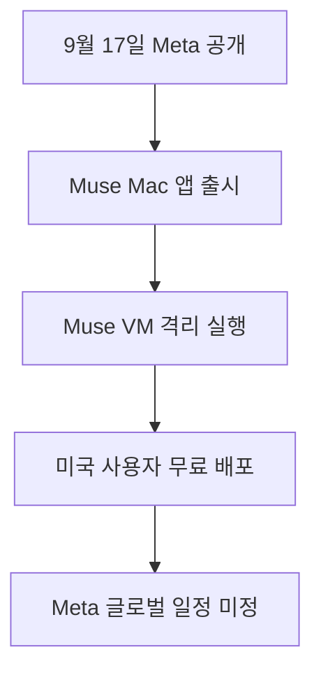

Meta가 2026년 9월 17일 macOS 데스크톱 환경을 지원하는 개인용 AI 에이전트 Muse Mac 앱을 정식으로 배포했습니다 <a href="#source-1" aria-label="Meta 공식 발표 출처">[1]</a>. 이제 브라우저 창에서 복사해 붙여넣는 번거로움 없이 **Mac 내부의 로컬 파일과 캘린더 및 메일을 AI가 직접 넘나들며 실행하는 환경**이 열렸습니다 <a href="#source-2" aria-label="Unite.AI 보도 출처">[2]</a>. 평소 흩어진 파일과 쌓인 일정 정리에 치이던 직장인이라면 컴퓨터 작업 방식 자체가 통째로 바뀌는 경험을 마주하게 됩니다. 대화창에 갇혀 글자만 주고받던 기존 도구들과 달리 운영체제 깊숙한 곳에서 실무를 돕는 바탕화면 도우미가 등장한 셈입니다.

> **먼저 알아둘 용어**
>
> - **에이전트**: 사람이 단계마다 지시하지 않아도 스스로 여러 작업을 이어서 처리하는 AI입니다.
{: .prompt-info }

## 무슨 일이 벌어진 걸까?

Meta는 개인용 인공지능 비서 서비스인 Muse를 컴퓨터 바탕화면 환경에서 온전히 쓸 수 있는 네이티브 macOS 클라이언트로 출시했습니다 <a href="#source-1" aria-label="Meta 공식 발표 출처">[1]</a>. 네이티브 클라이언트란 웹 브라우저를 거치지 않고 운영체제 자체에 맞추어 직접 돌아가도록 설계한 전용 프로그램을 뜻합니다. 앞서 Meta는 2026년 9월 8일 iOS와 Android 그리고 웹 환경에서 Muse를 처음 선보였습니다 <a href="#source-2" aria-label="Unite.AI 보도 출처">[2]</a>. 그로부터 열흘도 채 지나지 않은 2026년 9월 17일에 전용 Mac 애플리케이션까지 빠르게 확장한 셈입니다.

이번에 공개된 Mac 전용 프로그램은 컴퓨터 속에 저장된 로컬 파일뿐 아니라 Apple의 기본 프로그램들과 깊숙하게 맞물립니다 <a href="#source-1" aria-label="Meta 공식 발표 출처">[1]</a>. 구체적으로 Mail, Messages, Calendar, Notes에 바로 닿도록 설계되었습니다. 컴퓨터 안에서 어디에 두었는지 잊어버린 문서를 대신 찾아주고, 복잡하게 어질러진 폴더를 제자리에 분류해 정리해 줍니다. 또한 여러 대화방에 흩어진 메시지와 적어둔 메모를 차분하게 요약해 주는 역할도 도맡습니다. 복잡한 수작업 없이 바탕화면에서 곧장 명령을 내릴 수 있는 구조입니다.

이 과정에서 프로그램이 사용자 컴퓨터 전체를 제멋대로 헤집고 다니지 않도록 안전장치를 두었습니다. Muse는 **Muse Secure VM이라는 별도의 전용 클라우드 가상 머신** 안에서 실행됩니다 <a href="#source-2" aria-label="Unite.AI 보도 출처">[2]</a>. 가상 머신이란 실제 컴퓨터 부품과 분리된 채 인터넷 구름 너머에서 독립적으로 작동하는 소프트웨어 속 컴퓨터를 말합니다. 실제 사용자의 기기 자원을 직접 건드려 오류를 내는 대신 격리된 안전 공간에서 계획을 세우고 도구를 움직이도록 만든 형태입니다.

여기에 민감한 작업을 실제로 실행하기 전에 주인의 허락을 받아내도록 지키는 Sentinel 에이전트라는 감시 장치를 함께 배치했습니다 <a href="#source-2" aria-label="Unite.AI 보도 출처">[2]</a>. 사용자가 직접 승인 단추를 누르지 않으면 위험성이 있는 작업은 한 발짝도 나아가지 못하게 막은 셈입니다. 이 덕분에 바탕화면의 중요한 자료가 무단으로 변경되거나 전송될 위험을 기술적으로 차단합니다. 자율적인 도구 실행과 엄격한 사용자 통제를 결합해 안전성을 챙기려는 Meta의 설계 방식이 돋보이는 대목입니다.

<figure class="news-source-image">
  
  <figcaption>Meta가 원문과 함께 공개한 이미지입니다. <a href="https://ai.meta.com/muse/download" target="_blank" rel="noopener noreferrer">출처: Meta</a></figcaption>
</figure>

## 왜 지금 다들 이 이야기를 할까?

이번 발표가 큰 관심을 끄는 이유는 대화창 속에 갇혀 있던 생성형 인공지능이 마침내 내 컴퓨터의 실제 운영체제로 내려왔기 때문입니다. 이전까지 인공지능 도구는 사용자가 직접 웹 브라우저를 열고, 문서를 일일이 끌어다 넣고, 질문을 타이핑해야만 겨우 답을 돌려주었습니다. 컴퓨터 화면 한쪽에서는 메일을 확인하고 다른 쪽에서는 파일을 뒤적이며 인공지능 창으로 복사해 붙여넣는 번거로운 반복 작업이 일상이었습니다. 이러한 파편화된 사용 경험은 직장인들의 일상적인 집중력을 끊임없이 흐트러뜨리는 주요 원인이었습니다.

Meta는 이 피로한 중간 과정을 건너뛰도록 만들었습니다. 컴퓨터 바탕화면 자체에서 에이전트가 직접 파일 폴더를 탐색하고, 일정표를 열어보고, 메모 앱을 훑어보며 일처리를 돕습니다. 사용자가 프로그램 사이를 오가며 다리를 놓아줄 필요 없이 에이전트가 소프트웨어 사이를 자유롭게 넘나드는 시대로 진입한 것입니다.

더욱이 스마트폰과의 매끄러운 작업 이어받기를 구현했습니다. Mac 앱은 기기 사이의 작업 연속성을 지원합니다 <a href="#source-1" aria-label="Meta 공식 발표 출처">[1]</a>. 이동 중에 모바일 기기나 WhatsApp 메신저에서 시작해 둔 업무 명령을 사무실 책상 앞 데스크톱 화면에서 그대로 이어받아 확인하고 추적할 수 있습니다 <a href="#source-2" aria-label="Unite.AI 보도 출처">[2]</a>. 장소와 단말기에 구애받지 않고 업무 흐름이 하나로 이어지는 환경을 보여줍니다.

| 비교 항목 | 기존의 웹 기반 생성형 AI | Meta Muse Mac 앱 |
| --- | --- | --- |
| 구동 환경 | 웹 브라우저 탭 내부 | macOS 전용 네이티브 데스크톱 앱 |
| 연동 대상 | 업로드한 개별 파일 및 텍스트 창 | 로컬 파일, Mail, Messages, Calendar, Notes |
| 작업 연속성 | 브라우저 세션 중심 | 모바일 및 WhatsApp 연계 크로스 디바이스 작업 지원 |
| 안전 통제 | 채팅창 필터링 중심 | Muse Secure VM 환경과 Sentinel 승인 절차 |
| 배포 형태 | 웹사이트 접속 | Meta 공식 웹사이트 직접 디스크 이미지 다운로드 |

표에서 확인되듯 작업의 무대가 브라우저 바깥으로 완전히 옮겨갔습니다. 이 작은 위치 이동이 컴퓨터를 다루는 사람의 손과 시선을 해방해 주기 때문에 많은 이들이 이 변화에 주목하고 있습니다. 일상적인 사무 작업의 중심축이 대화 중심에서 행동 중심으로 옮겨가고 있음을 뚜렷하게 보여주는 사례입니다.

<figure class="news-source-image">
  
  <figcaption>Unite.AI가 원문과 함께 공개한 이미지입니다. <a href="https://www.unite.ai/meta-launches-muse-mac-app-with-file-messages-and-calendar-access" target="_blank" rel="noopener noreferrer">출처: Unite.AI</a></figcaption>
</figure>

## 그래서 우리에게 뭐가 달라질까?

이 기술이 일상에 들어오면 컴퓨터를 켜고 문서를 찾느라 보내던 낭비 시간이 크게 줄어듭니다. 예를 들어 여러 부서에서 제각기 보낸 첨부파일이 다운로드 폴더에 수십 개 쌓여 있는 상황을 상상해 볼 수 있습니다. 파일 이름조차 제각각이라 필요한 보고서를 찾으려면 일일이 열어보아야 했던 직장인이라도, 이제는 Muse에게 관련 문서들을 주제별로 묶어달라고 부탁할 수 있습니다. 흩어진 자료를 분류하느라 퇴근을 미루던 직장인의 손길을 대신해 컴퓨터가 알아서 바구니를 나누고 정리해 주는 셈입니다.

또한 약속을 잡고 안부를 확인하는 과정도 한결 가벼워집니다. Messages 대화방에서 동료가 남긴 마감 일정이나 메모 앱에 급히 적어둔 아이디어를 일일이 찾아다니지 않아도 됩니다. Muse가 캘린더 일정과 연결되어 메일과 대화 기록을 파악하고 요약본을 만들어 주기 때문입니다. 파편화된 일정 사이에서 마감 기한을 놓칠까 전전긍긍하던 부담을 덜어주는 든든한 비서가 컴퓨터 안에 상주하는 느낌을 줍니다.

스마트폰을 쥐고 외출하던 중에 메신저로 급한 파일 취합을 맡겨두고, 사무실로 돌아와 Mac을 열었을 때 **스마트폰에서 시킨 일이 데스크톱 화면 위에 고스란히 이어져 있는 장면**은 업무의 리듬을 완전히 바꿔 놓습니다 <a href="#source-1" aria-label="Meta 공식 발표 출처">[1]</a>. 밖에서 메신저를 통해 건넨 지시 사항을 사무실의 큰 화면에서 확인하며 결과물만 승인하면 되는 매끄러운 경험을 누릴 수 있습니다.

무엇보다 일상 속에서 가장 반가운 점은 이 강력한 기능을 도입하기 위해 큰 비용을 치르지 않아도 된다는 사실입니다. 현재 해당 프로그램은 Meta 공식 웹사이트를 통해 무료 디스크 이미지 파일 형태로 배포되고 있습니다 <a href="#source-1" aria-label="Meta 공식 발표 출처">[1]</a>. Mac 사용자라면 별도의 구독료 결제 단계 없이도 데스크톱 인공지능 에이전트 환경을 자신의 작업 공간에 직접 설치해 볼 수 있습니다. 개인 창작자나 일인 사업자에게도 비용 부담 없이 작업 능률을 끌어올릴 수 있는 기회가 열린 셈입니다.

<figure class="news-source-image">
  
  <figcaption>Unite.AI가 원문과 함께 공개한 이미지입니다. <a href="https://www.unite.ai/meta-launches-muse-mac-app-with-file-messages-and-calendar-access" target="_blank" rel="noopener noreferrer">출처: Unite.AI</a></figcaption>
</figure>

## 그래서 내 업무에는 뭐가 달라지나

지금 당장 업무에 변화를 주고 싶은 실무자라면 서둘러 시도해 볼 수 있는 구체적인 실행 방법이 있습니다. 첫째로, 미국 계정을 보유하거나 해당 환경에 접근할 수 있는 사용자라면 Meta 공식 다운로드 페이지에서 **설치용 디스크 이미지 파일을 내려받아 Mac에 설치**합니다 <a href="#source-1" aria-label="Meta 공식 발표 출처">[1]</a>. 설치를 마치고 나면 Mail, Messages, Calendar, Notes 등 기본 애플리케이션과의 연결 권한을 확인하고 필요한 항목들을 하나씩 허용해 줍니다. 초기 설정을 꼼꼼히 마쳐두어야 이후의 자동화 명령이 막힘없이 실행됩니다.

둘째로, 다운로드 폴더나 바탕화면처럼 평소 손대기 어려울 만큼 복잡하게 엉켜 있는 디렉터리를 하나 골라 파일 정리와 위치 찾기 작업을 먼저 맡겨봅니다 <a href="#source-2" aria-label="Unite.AI 보도 출처">[2]</a>. 거대한 프로젝트 전체를 단번에 맡기기보다는, 어디에 두었는지 가물가물한 회의록을 찾게 하거나 흩어진 영수증 이미지 파일을 한 폴더로 모으게 하는 일부터 시작하는 편이 좋습니다. 에이전트가 내린 파일 분류 결과를 직접 확인하며 신뢰 수준을 차근차근 점검하는 실천적인 출발점입니다.

마지막으로, 외출할 때 WhatsApp이나 모바일 환경을 통해 간단한 요약이나 일정 체크 작업을 던져두고 데스크톱으로 돌아와 작업 추적이 이어지는지 점검합니다 <a href="#source-1" aria-label="Meta 공식 발표 출처">[1]</a>. 이처럼 손이 덜 가는 작은 단위의 비동기 작업부터 점진적으로 일감을 넘기는 습관을 들이면 일상의 작업 속도를 크게 끌어올릴 수 있습니다. 일일이 컴퓨터 앞에 앉아 화면을 지켜보지 않아도 업무가 진행되는 방식을 체감해 보는 가장 빠른 길입니다.

## 아직은 선을 그어야 할 부분

하지만 기대가 큰 만큼 지나친 환상은 내려놓아야 합니다. 지금 공개된 Muse Mac 앱에는 명확한 지역과 기능의 한계가 존재합니다. 우선 배포 대상 자체가 **미국에 있는 사용자로 한정**되어 있습니다 <a href="#source-1" aria-label="Meta 공식 발표 출처">[1]</a>. Meta는 미국 외 다른 국가나 지역으로 언제 서비스를 넓힐지에 대한 구체적인 일정을 아직 공개하지 않았습니다. 널리 쓰이는 Windows 운영체제용 데스크톱 프로그램을 언제 내놓을지에 대한 계획 역시 현재로서는 전혀 밝혀진 바가 없습니다. 따라서 국내 사용자나 윈도우 환경 중심의 조직은 당장 업무 프로세스 전체를 전환하기 어렵습니다.

보안과 권한 관리 측면에서도 아직 지켜보아야 할 빈틈이 있습니다. Meta는 Sentinel 에이전트가 민감한 작업을 가로막고 승인을 구한다고 설명하지만, 구체적으로 어떤 명령과 파일 조작이 이 민감한 영역에 해당하는지에 대한 세부 기준을 명확히 제시하지 않았습니다. 어떤 수준의 작업까지 자동으로 넘어가고 어디서부터 사용자 승인 창이 뜨는지 구체적 기준이 모호한 상태입니다.

게다가 기업 전산팀이 전체 직원의 단말기를 한꺼번에 통제할 수 있는 모바일 기기 관리 통제 기능의 지원 여부도 아직 불확실합니다. 전사적 차원의 보안 정책이 수립되지 않은 상태에서 무턱대고 사내 기기에 도입하기에는 제도적 위험이 따릅니다. 따라서 회사 내부의 보안 자료나 대외비 문서를 통째로 다루는 일은 여전히 신중해야 합니다. 기술의 편리함에 가려진 관리 공백을 명확히 인식하고 단계적으로 접근하는 태도가 필수적입니다.

<!-- primary-sources:start -->
## 원문과 버전 확인

- [발표 원문](https://ai.meta.com/muse/download)
- [Unite.AI](https://www.unite.ai/meta-launches-muse-mac-app-with-file-messages-and-calendar-access)
- [9to5Mac](https://9to5mac.com/2026/09/17/meta-ai-launches-muse-personal-agent-including-apps-for-iphone-and-mac)
<!-- primary-sources:end -->

<!-- internal-links:start -->
## 함께 읽으면 이해가 이어지는 글

- [Meta 자율형 개인 비서 Muse 출시, 앱 넘나들며 결제까지 수행한다]() — Meta가 2026년 9월 8일 Muse Spark 1.3 모델로 구동되는 개인 비서 Muse를 출시했습니다. 각 사용자에게 독립된 가상 머신을 제공해 데이터 유출을 막고 Stripe 연동 일회용 가상 카드로 안전한 결제를 돕습니다…
- [Meta Muse Glimmer 30B 로컬 에이전트: 4비트 메모리 조건과 도입 판단]() — Meta가 2026년 8월 10일 소비자용 GPU 환경에 최적화된 300억 파라미터 오픈소스 모델 Muse Glimmer를 Apache 2.0 라이선스로 출시했습니다. 4비트 양자화를 적용해 메모리 점유율을 20GB RAM 이하로…
- [Meta, Muse Spark 1.1 탑재한 Meta AI 에이전트 출시… Gmail와 Google Calendar 연동 및 자율 작업 실행]() — Meta는 2026년 7월 24일 웹과 모바일 환경의 Meta AI에 Muse Spark 1.1 기반의 에이전트 기능을 탑재하여 정식 출시했습니다. 이번 업데이트를 통해 Meta AI는 Google Calendar와 Gmail…
<!-- internal-links:end -->

## 자주 묻는 질문

### Meta Muse Mac 앱은 무료로 이용할 수 있나요?

무료로 이용할 수 있습니다. Meta 웹사이트에서 디스크 이미지 파일을 직접 내려받을 수 있으나 현재 배포 대상은 미국 사용자로 한정되어 있습니다.

### Mac 앱은 컴퓨터 내부의 어떤 프로그램과 연동되나요?

컴퓨터의 로컬 파일과 Apple 기본 앱인 Mail, Messages, Calendar, Notes에 연동됩니다. 분실된 파일을 찾고 일정을 정리하며 대화와 메모 요약을 돕습니다.

### 인공지능이 제멋대로 중요한 컴퓨터 파일을 삭제하거나 수정할 위험은 없나요?

제멋대로 수정할 수 없습니다. Muse는 격리된 클라우드 가상 머신에서 동작하며 Sentinel 에이전트가 민감한 작업 전에 사용자 승인을 필수로 요구합니다.

### Windows 데스크톱 버전이나 한국 출시 일정은 어떻게 되나요?

아직 출시 일정이 공개되지 않았습니다. Meta는 미국 외 지역 확장 일정과 Windows 데스크톱 지원 계획에 대해 밝히지 않은 상태입니다.

## 직접 확인한 원문

<ol class="checked-source-list">
  <li id="source-1"><a href="https://ai.meta.com/muse/download" target="_blank" rel="noopener noreferrer">Meta — Download Muse: Free AI Agent for Mac &amp; Mobile | AI at Meta</a> (2026-09-17)</li>
  <li id="source-2"><a href="https://www.unite.ai/meta-launches-muse-mac-app-with-file-messages-and-calendar-access" target="_blank" rel="noopener noreferrer">Unite.AI — Meta Launches Muse Mac App With File, Messages, and Calendar Access</a> (2026-09-18)</li>
  <li id="source-3"><a href="https://9to5mac.com/2026/09/17/meta-ai-launches-muse-personal-agent-including-apps-for-iphone-and-mac" target="_blank" rel="noopener noreferrer">9to5Mac — Meta AI launches Muse personal agent, including apps for iPhone and Mac</a> (2026-09-17)</li>
</ol>

> 이 글은 위 원문을 직접 확인해 작성했습니다. 가격, 기능 범위, 지역별 제공 여부는 게시 후 바뀔 수 있으니 실제 도입 전 공식 문서를 다시 확인하세요.
