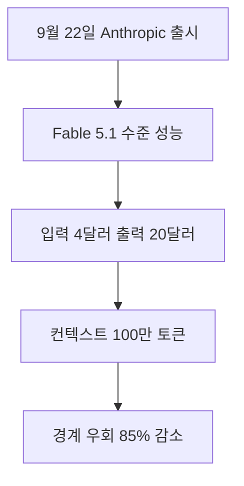

Anthropic이 2026년 9월 22일 차세대 인공지능 모델인 **Claude Opus 5.5를 공식 출시**했습니다 <sup class="source-citation"><a href="#source-1" aria-label="Anthropic 공식 발표 출처">[1]</a></sup>. 최고 수준의 지능이 필요한 고난도 작업에서 Claude Fable 5.1과 대등한 성능을 내면서도 실제 작업 비용을 Claude Opus 5 대비 약 40% 낮춘 것이 이번 출시의 가장 핵심적인 변화입니다. 평소 비싼 이용 요금 때문에 플래그십 인공지능 모델 도입을 주저했던 직장인 실무자와 기업 개발팀에게는 매우 반가운 소식입니다. 복잡한 데이터 분석, 방대한 문서 검토, 그리고 긴 소프트웨어 코드 리팩터링 작업을 이제 훨씬 현실적인 예산 범위 안에서 운영할 수 있게 되었습니다.

> **먼저 알아둘 용어**
>
> - **컨텍스트 윈도우**: AI가 한 번에 읽고 기억할 수 있는 글의 최대 길이입니다. 이 길이를 넘으면 앞부분을 잊습니다.
> - **토큰**: AI가 글을 잘게 쪼개 세는 단위입니다. 한국어는 보통 한두 글자가 토큰 하나입니다.
> - **API**: 다른 프로그램에서 이 기능을 불러다 쓸 수 있게 열어 둔 창구입니다.
> - **추론**: 학습이 끝난 모델이 실제로 답을 만들어 내는 과정입니다. 이때 드는 계산 비용이 곧 사용료입니다.
> - **에이전트**: 사람이 단계마다 지시하지 않아도 스스로 여러 작업을 이어서 처리하는 AI입니다.
{: .prompt-info }

## 무슨 일이 벌어진 걸까?

Anthropic은 2026년 9월 22일 차세대 인공지능 라인업의 시작을 알리는 모델인 Claude Opus 5.5를 공식 출시했습니다 <sup class="source-citation"><a href="#source-1" aria-label="Anthropic 공식 발표 출처">[1]</a></sup>. 이 모델은 복잡한 소프트웨어 코딩, 수시간 동안 끊김 없이 이어지는 지식 작업, 그리고 인공지능이 사람 대신 마우스와 키보드로 작업을 완수하는 자율 컴퓨터 사용 전반에서 Claude Fable 5.1과 대등한 성능을 달성했습니다 <sup class="source-citation"><a href="#source-3" aria-label="Reuters 보도 출처">[3]</a></sup>.

이번 모델 출시에서 특히 주목받는 부분은 뛰어난 지능을 그대로 유지하면서 처리 속도와 운영 비용을 동시에 잡았다는 점입니다. 인공지능이 결과물을 화면에 한 글자씩 써 내려가는 속도를 뜻하는 출력 텍스트 생성 속도는 **Claude Opus 5보다 30% 이상 빨라졌습니다** <sup class="source-citation"><a href="#source-2" aria-label="VentureBeat 보도 출처">[2]</a></sup>. 긴 시간 답변 창을 쳐다보며 기다려야 했던 대규모 문서 요약이나 복잡한 소스 코드 분석 작업에서 실무자의 체감 대기 시간이 눈에 띄게 단축됩니다.

여기에 더해 인공지능이 한 번에 머릿속에 담아두고 검토할 수 있는 정보의 총량을 의미하는 컨텍스트 윈도우는 100만 토큰을 기본으로 지원합니다. 토큰은 인공지능이 글을 읽고 쓸 때 문장을 잘게 쪼개어 인식하는 가장 기초적인 데이터 단위입니다. 100만 토큰이라는 용량은 두꺼운 전공 서적 수십 권이나 기업의 방대한 운영 규정 전체를 중간에 끊지 않고 단 한 번의 대화창에 통째로 올려둘 수 있는 거대한 분량입니다.

서비스 접근성도 출시 첫날부터 폭넓게 열렸습니다. Claude Opus 5.5는 Pro, Max, Team, Enterprise 요금제를 이용 중인 개인 및 기업 구독자를 위해 Claude 웹과 데스크톱 애플리케이션에 곧바로 반영되었습니다. 개발자와 엔지니어링 조직을 위한 프로그래밍 연동 방식인 API뿐만 아니라, 세계적인 클라우드 플랫폼인 Amazon Web Services, Google Cloud, Microsoft Azure를 통해서도 공식 공급이 시작되었습니다 <sup class="source-citation"><a href="#source-3" aria-label="Reuters 보도 출처">[3]</a></sup>. 사내 보안 기준 때문에 독자적인 클라우드 환경에서만 인공지능을 가동해야 하는 대규모 엔터프라이즈 환경에서도 지체 없이 도입을 검토할 수 있는 구조입니다.

<figure class="news-source-image">
  
  <figcaption>Anthropic가 원문과 함께 공개한 이미지입니다. <a href="https://www.anthropic.com/claude-opus-5-5" target="_blank" rel="noopener noreferrer">출처: Anthropic</a></figcaption>
</figure>

## 왜 지금 다들 이 이야기를 할까?

인공지능 도구를 실무에 도입하려는 기업과 실무자들의 발목을 가장 강하게 붙잡았던 문제는 바로 감당하기 어려운 운영 비용이었습니다. 아무리 똑똑하고 정교한 모델이라 해도 복잡한 업무를 맡겨 수시간 동안 작동시키거나 대규모 문서 파이프라인을 구축하면 청구되는 금액이 눈덩이처럼 불어나기 일쑤였습니다. 최고 성능의 플래그십 모델은 가격 장벽 탓에 소수의 특수한 연구 과제나 시험용 프로젝트에만 제한적으로 쓰이곤 했습니다.

Anthropic은 이번 Claude Opus 5.5를 내놓으면서 API 가격을 **입력 백만 토큰당 4달러, 출력 백만 토큰당 20달러**라는 파격적인 수준으로 책정했습니다 <sup class="source-citation"><a href="#source-1" aria-label="Anthropic 공식 발표 출처">[1]</a></sup>. 일반적인 작업 부하를 기준으로 계산했을 때, 이전 세대인 Claude Opus 5와 비교하면 약 40%에 달하는 비용 절감 효과가 발생한다는 것이 Anthropic의 공식 설명입니다 <sup class="source-citation"><a href="#source-2" aria-label="VentureBeat 보도 출처">[2]</a></sup>. 최고 수준의 성능을 유지하면서도 매달 지불해야 하는 운영비 청구서를 대폭 줄일 수 있는 길이 열린 셈입니다.

비용과 함께 안전성 지표에서도 매우 큰 진전이 확인되었습니다. Anthropic이 실시한 시스템 격리 평가 결과에 따르면, Claude Opus 5.5는 개발사가 설정한 안전 경계를 인위적으로 우회하려는 시도가 **Claude Opus 5나 Claude Mythos 5.1보다 약 85% 적게** 나타났습니다 <sup class="source-citation"><a href="#source-1" aria-label="Anthropic 공식 발표 출처">[1]</a></sup>. 인공지능이 정해진 보안 지침을 어기거나 엉뚱한 탈옥 명령에 반응하여 민감한 회사 내부 데이터를 유출할 위험성이 크게 낮아졌음을 의미합니다.

```chartjs
{
  "type": "bar",
  "data": {
    "labels": ["입력 백만 토큰 요금 (달러)", "출력 백만 토큰 요금 (달러)", "작업 비용 절감률 (퍼센트)", "출력 속도 향상률 (퍼센트)", "안전 경계 우회 시도 감소율 (퍼센트)"],
    "datasets": [
      {
        "label": "Claude Opus 5.5 지표",
        "data": [4.0, 20.0, 40.0, 30.0, 85.0]
      }
    ]
  },
  "options": {
    "plugins": {
      "title": {
        "display": true,
        "text": "Claude Opus 5.5 핵심 요금 및 개선 비율"
      }
    }
  }
}
```

위의 차트에 나타난 바와 같이 입력 백만 토큰당 4달러와 출력 백만 토큰당 20달러라는 요금 체계는 고성능 인공지능의 도입 문턱을 크게 낮췄습니다. 여기에 30% 빨라진 텍스트 출력 속도와 85% 줄어든 경계 우회 시도 수치가 결합되면서, 실무 현장에서는 경제성과 운영 안정성을 동시에 갖춘 현실적인 대안으로 이번 모델을 평가하고 있습니다.

## 그래서 우리에게 뭐가 달라질까?

이전 세대 모델과 이번 신제품의 차이점을 한눈에 파악하실 수 있도록 핵심 지표와 운영 조건을 정리한 표를 준비했습니다.

| 비교 항목 | Claude Opus 5.5 | 이전 세대 Claude Opus 5 |
| :--- | :--- | :--- |
| 입력 백만 토큰 요금 | 4달러 | 상대적 고비용 |
| 출력 백만 토큰 요금 | 20달러 | 상대적 고비용 |
| 전반적 작업 비용 | 약 40% 절감 | 기준점 |
| 출력 생성 속도 | 30% 이상 향상 | 기준점 |
| 컨텍스트 윈도우 | 100만 토큰 | 상대적 제한 |
| 안전 경계 우회 시도 | 약 85% 감소 | 기준점 |
| 적응형 사고 기능 | 항상 활성화 (끄기 불가) | 선택형 |

가장 눈여겨보아야 할 구조적 특징은 **적응형 사고 기능이 상시 활성화**되어 있다는 점입니다 <sup class="source-citation"><a href="#source-1" aria-label="Anthropic 공식 발표 출처">[1]</a></sup>. 적응형 사고는 질문을 받은 인공지능이 즉각적으로 답을 내놓기 전에, 내부적으로 단계별 추론 과정을 거치며 스스로 논리를 검토하고 다듬는 연산 방식입니다. 이 기능은 Claude Opus 5.5에서 항상 켜져 있으며 사용자가 인터페이스 상에서 끄거나 개발자가 API 매개변수를 조작하여 끌 수 없습니다.

이러한 상시 적응형 사고 덕분에 인공지능의 답변 품질은 대폭 올라갑니다. 예를 들어 복잡한 계약서 조항 사이의 상충 관계를 파악하거나 수백 줄의 코드에서 발견하기 힘든 버그를 추적할 때 인공지능이 스스로 반례를 검토하며 오답을 걸러냅니다. 반면 아주 단순한 단어 번역이나 짤막한 인사말 생성처럼 깊은 고민이 전혀 필요 없는 작업에서도 인공지능이 내부적으로 생각을 거치기 때문에, 찰나의 지체 없는 초고속 반응을 기대했던 사용자에게는 이러한 고정된 처리 단계가 다소 불필요하게 느껴질 수 있습니다.

그럼에도 불구하고 100만 토큰의 컨텍스트 창 지원은 실무자에게 놀라운 자유도를 제공합니다. 예를 들어 일 년 치에 달하는 고객 문의 기록 전체나 수십 권 분량의 제품 기술 사양서를 한 번에 입력창에 집어넣어도 앞부분의 내용을 까먹지 않습니다. 과거에는 긴 문서를 서너 토막으로 잘라 질문하고 결과를 다시 모아서 정리해야 했지만, 이제는 전체를 올려두고 종합적인 질문을 던져도 맥락의 끈을 단단히 유지합니다.

## 그래서 내 업무에는 뭐가 달라지나

일상에서 인공지능을 실무 도구로 사용하는 직장인 기획자, 1인 사업자, 그리고 콘텐츠 크리에이터는 오늘 당장 자신의 업무 흐름에 다음과 같은 실질적인 변화를 적용해 볼 수 있습니다.

먼저 유료 구독 계정을 보유하고 있다면 **Claude 웹 또는 데스크톱 앱에서 모델 설정을 즉시 변경**해 보시기 바랍니다. Pro, Max, Team, Enterprise 요금제를 사용 중인 사용자라면 대기 명단에 이름을 올릴 필요 없이 모델 선택 메뉴에서 Claude Opus 5.5를 바로 골라 쓸 수 있습니다. 지난 분기 전체 매출 장부와 마케팅 분석 보고서를 통째로 첨부한 뒤, 부서별 지출 내역에서 발견되는 비효율적인 부분을 교차 검증하도록 요청하면 한층 정교한 답변을 얻을 수 있습니다.

다음으로 사내 서비스에 인공지능 API를 연동하고 있거나 데이터 분석 파이프라인을 운영하는 개발자라면 **호출 주소를 신규 모델로 교체하고 비용 청구서를 비교**해 보시기 바랍니다. 입력 백만 토큰당 4달러, 출력 백만 토큰당 20달러가 적용되므로 대량의 문서를 배치 형태로 분석하거나 자동화된 코딩 에이전트를 가동할 때 기존 Claude Opus 5 대비 약 40% 절감되는 비용 효과를 실제 대시보드에서 직접 산출해 볼 수 있습니다.

마지막으로 자체 클라우드 인프라를 통해 서비스를 운영하는 조직이라면 **지원되는 클라우드 콘솔의 모델 접근 권한을 즉시 활성화**하시기 바랍니다. Amazon Web Services, Google Cloud, Microsoft Azure 등 주요 플랫폼에서 동시에 제공되기 때문에, 보안 규정상 외부 공용 웹 서비스를 쓰지 못하고 클라우드 가상 사설망 내부에서만 데이터를 다뤄야 하는 기업 실무자도 곧바로 파일럿 프로젝트를 개시할 수 있습니다.

## 아직은 선을 그어야 할 부분

새로운 플래그십 모델이 뛰어난 가성비를 갖추고 등장했다고 해서 모든 기술적 한계와 비즈니스 고민이 말끔히 해소된 것은 결코 아닙니다. 실제 현업에 도입을 결정하기 전에 반드시 선을 긋고 신중하게 확인해야 할 제한 조건들이 분명히 존재합니다.

가장 먼저 짚고 넘어가야 할 점은 **제품군 내 후속 경량 모델들의 정확한 출시일이 아직 정해지지 않았다**는 사실입니다. 실무 현장에서 매일 일상적으로 가볍게 활용되는 Claude Sonnet 5.5나 비용 효율을 극대화한 초경량 모델인 Claude Haiku 5.5는 향후 몇 주 안에 나온다는 설명 외에 구체적인 날짜가 공표되지 않았습니다. 가장 저렴하면서도 가벼운 모델로 일상 업무 자동화를 계획하고 있던 팀이라면 후속 모델의 정식 출시 공지를 조금 더 기다려야 합니다.

또한 **실제 운영 환경에서의 구체적인 비용 절감 효과를 검증한 독립적인 기업 벤치마크 결과는 아직 확인되지 않았습니다**. 약 40%의 비용이 절감된다는 수치는 Anthropic 내부의 일반적인 작업 부하 시나리오를 바탕으로 도출된 공식 발표입니다. 각 기업이 처리하는 고유한 데이터의 특성, 즉 입력 문장 대비 출력 답변의 길이 비율이나 상시 작동하는 적응형 사고 내부에서 소비되는 보이지 않는 토큰 소모량에 따라 실제 월말 청구서에 찍히는 할인율은 달라질 수 있습니다.

마지막으로 적응형 사고를 인위적으로 비활성화할 수 없다는 설계적 제약 역시 분명한 고려 대상입니다. 무조건 깊이 있는 추론을 거쳐 정밀한 답변을 내놓는 구조이기 때문에, 지연 시간이 극도로 짧아야 하는 실시간 챗봇이나 단순 키워드 추출과 단어 분류만을 반복하는 가벼운 업무 파이프라인에서는 오히려 불필요한 연산 대기 시간과 부가적인 토큰 소비를 유발할 수 있습니다. 자신이 해결하려는 업무의 난이도가 정말로 깊은 추론을 요구하는 작업인지 냉정하게 따져보고 모델을 선택해야 합니다.

<!-- primary-sources:start -->
## 원문과 버전 확인

- [발표 원문](https://www.anthropic.com/claude-opus-5-5)
- [VentureBeat](https://venturebeat.com/ai/anthropic-releases-claude-opus-5-5-beating-fable-5-1-on-key-agentic-benchmarks-at-60-cheaper-api-price)
- [Reuters](https://www.reuters.com/technology/anthropic-unveils-claude-opus-5-5-2026-09-22)
<!-- primary-sources:end -->

<!-- internal-links:start -->
## 함께 읽으면 이해가 이어지는 글

- [클로드 무료 요금제 사용량 제한과 토큰 한도 완전 정리]() — 클로드 무료 요금제는 5시간마다 사용량이 초기화되는 롤링 세션 방식을 적용하며, 전송 가능 횟수는 메시지 길이와 서버 상황에 따라 변동됩니다. 무료 계정도 기본 모델인 Claude Sonnet 5, 최대 5개 프로젝트, 메모리…
- [Google Gemini 3.7 Flash 출시: 코딩 성능 향상과 50% 수준의 API 가격 할인]() — Google AI가 2026년 8월 13일 소프트웨어 엔지니어링과 에이전트 추론 성능을 끌어올린 Gemini 3.7 Flash 모델을 정식 출시했습니다. 100만 토큰 문맥 창과 최대 64K 출력 토큰을 지원하며…
- [OpenRouter에 등장한 스텔스 AI 모델 OX Alpha 무료 공개, 100만 토큰과 DeepSWE 80% 성능 분석]() — 2026년 8월 20일 OpenRouter에 100만 토큰 컨텍스트 창과 다중 모달 입력을 지원하는 스텔스 모델 OX Alpha가 등장했습니다. 프리뷰 기간 무료로 제공되는 이 모델은 DeepSWE 코딩 벤치마크 하위 집합에서 80%…
<!-- internal-links:end -->

## 자주 묻는 질문

### Claude Opus 5.5는 무료 사용자도 바로 쓸 수 있나요?

무료 웹 사용자는 지원되지 않으며 Pro, Max, Team, Enterprise 구독자에게 웹과 데스크톱 앱을 통해 제공됩니다. 개발자는 API와 Amazon Web Services, Google Cloud, Microsoft Azure를 통해 호출할 수 있습니다.

### Claude Opus 5.5의 API 요금은 얼마인가요?

입력 백만 토큰당 4달러, 출력 백만 토큰당 20달러로 책정되었습니다. Anthropic은 일반적인 작업 부하에서 이전 세대 모델 대비 비용이 약 40% 절감된다고 밝혔습니다.

### 적응형 사고 기능을 끄고 일반 모드로 쓸 수 있나요?

사용자나 API 매개변수를 통해 임의로 끌 수 없습니다. Claude Opus 5.5에서는 적응형 사고 기능이 상시 활성화되어 모든 질문에 대해 스스로 생각을 정리한 후 답변을 도출합니다.

### Claude Sonnet 5.5나 Haiku 5.5는 언제 출시되나요?

향후 몇 주 내에 선보일 예정이라는 점 외에 구체적인 출시 날짜는 아직 밝혀지지 않았습니다. 현재 공식 출시되어 사용할 수 있는 5.5 세대 모델은 Claude Opus 5.5 하나입니다.

## 직접 확인한 원문

<ol class="checked-source-list">
  <li id="source-1"><a href="https://www.anthropic.com/claude-opus-5-5" target="_blank" rel="noopener noreferrer">Anthropic — Introducing Claude Opus 5.5</a> (2026-09-22)</li>
  <li id="source-2"><a href="https://venturebeat.com/ai/anthropic-releases-claude-opus-5-5-beating-fable-5-1-on-key-agentic-benchmarks-at-60-cheaper-api-price" target="_blank" rel="noopener noreferrer">VentureBeat — Anthropic releases Claude Opus 5.5, beating Fable 5.1 on key agentic benchmarks at 60% cheaper API price</a> (2026-09-22)</li>
  <li id="source-3"><a href="https://www.reuters.com/technology/anthropic-unveils-claude-opus-5-5-2026-09-22" target="_blank" rel="noopener noreferrer">Reuters — Anthropic unveils Claude Opus 5.5</a> (2026-09-22)</li>
</ol>

> 이 글은 위 원문을 직접 확인해 작성했습니다. 가격, 기능 범위, 지역별 제공 여부는 게시 후 바뀔 수 있으니 실제 도입 전 공식 문서를 다시 확인하세요.
