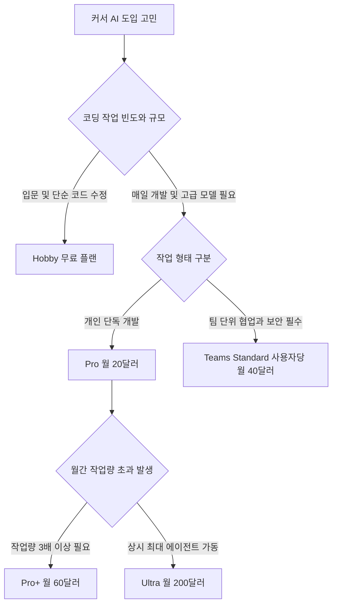

커서 AI 무료 유료 차이는 복잡한 작업을 스스로 수행하는 에이전트 한도와 최상위 지능을 갖춘 프론티어 모델 접근 권한에 있습니다. 무료 요금제인 Hobby는 결제 수단 등록 없이 기본적인 코드 편집과 다중 파일 수정을 지원합니다. 반면 월 20달러의 Pro 플랜부터는 최신 외부 인공지능 모델과 클라우드 에이전트 기능을 활용해 작업 생산성을 크게 높일 수 있습니다.

코드 편집기를 열고 인공지능 보조 도구를 쓰려는 사람들은 종종 요금제 선택 단계에서 혼란을 겪습니다. 무료 기능만으로 실무를 감당할 수 있는지, 언제 유료 구독을 결제해야 하는지 가늠하기 어렵기 때문입니다. 이 글은 2026년 9월 23일 기준 공식 정책을 바탕으로 무료와 유료의 실질적인 차이점을 명확히 정리하고 독자의 작업 방식에 맞는 최적의 선택 기준을 제시합니다.



> **먼저 알아둘 용어**
>
> - **에이전트**: 사람이 단계마다 지시하지 않아도 스스로 여러 작업을 이어서 처리하는 AI입니다.
> - **API**: 다른 프로그램에서 이 기능을 불러다 쓸 수 있게 열어 둔 창구입니다.
> - **토큰**: AI가 글을 잘게 쪼개 세는 단위입니다. 한국어는 보통 한두 글자가 토큰 하나입니다.
> - **프롬프트**: AI에게 건네는 지시문입니다. 같은 모델도 지시문에 따라 결과가 크게 달라집니다.
{: .prompt-info }

## 커서 ai 무료 사용법과 Hobby 플랜의 실제 한계

커서 AI 무료 사용법은 신용카드 정보를 입력할 필요 없이 공식 웹사이트에서 프로그램을 내려받아 설치하는 것으로 시작합니다. 무료 요금제의 공식 명칭은 Hobby 플랜입니다. 계정을 생성하고 로그인하기만 하면 즉시 코드 편집기 내부에서 인공지능 지원을 받을 수 있습니다. 결제 정보를 요구하지 않으므로 추가 요금이 청구될 걱정 없이 안전하게 체험을 시작할 수 있다는 점이 큰 장점입니다. 기본 코드 작성과 자동 완성, 간단한 질의응답을 무료 환경에서 곧바로 활용할 수 있습니다.

Hobby 플랜은 제한된 에이전트(Agent, 사용자의 지시를 받아 스스로 코드를 탐색하고 작성하며 수정까지 진행하는 자율 작업 도구) 요청과 작곡가(Composer) 접근 권한을 기본으로 제공합니다. 작곡가는 프로젝트 내 여러 파일을 한 번에 읽고 수정 사항을 나란히 비교하여 자동으로 반영해 주는 다중 파일 편집 도구입니다. 단일 파일 안에서 코드를 수정하는 단계를 넘어 관련된 다른 파일까지 함께 고쳐 주므로 작은 규모의 작업에서는 매우 효율적입니다. 웹 페이지 레이아웃을 고치거나 짧은 파이썬 스크립트의 문법 오류를 잡는 일상 작업은 무료 플랜으로도 원활하게 처리할 수 있습니다.

그러나 무료 요금제에는 실제 개발 업무에서 부딪히게 되는 명확한 한계가 존재합니다. 스스로 코드를 실행하고 구조적 오류를 해결하는 에이전트 요청 횟수가 매우 엄격하게 제한되어 있습니다. 여러 모듈과 파일이 복잡하게 얽힌 중대형 프로젝트를 다루다 보면 인공지능이 코드베이스를 탐색하는 도중에 요청 한도에 도달하여 응답을 멈춥니다. 또한 최신 인공지능 모델을 자유롭게 선택하여 활용할 수 없으므로 정교한 추론 능력이 필요한 아키텍처 설계나 대규모 리팩터링(코드의 기능을 유지하면서 내부 구조를 개선하는 작업)에는 적합하지 않습니다.

결국 Hobby 플랜은 학습 목적이나 간헐적인 단순 수정에 가장 알맞습니다. 복잡한 시스템 개발이나 매일 이어지는 실무 프로젝트에 무료 플랜만으로 대응하려는 계획은 작업 중단 위험이 따릅니다. 사용 한도가 초과되면 다음 주기까지 작업 흐름이 끊기므로 실무자는 이 한계를 사전에 명확히 인지하고 작업 범위를 정해야 합니다.

## 커서 ai 무료 유료 차이와 요금제별 핵심 스펙 비교

커서 ai 무료 유료 차이의 핵심은 인공지능 모델의 선택 폭과 자동화 작업을 수행할 수 있는 처리 용량의 크기입니다. 개인용 유료 요금제는 Pro, Pro+, Ultra 세 가지 단계로 나뉩니다. Pro 플랜은 월 20달러(연간 결제 시 약 20% 할인)입니다. Hobby 플랜의 모든 기능에 더해 확장된 에이전트 한도와 프론티어 모델 접근 권한을 제공합니다. 프론티어 모델이란 현재 기술 수준에서 가장 지능과 추론 능력이 뛰어난 최상위 인공지능을 뜻합니다. 여기에 그록(Grok) 지원, 모델 컨텍스트 프로토콜(MCPs, AI가 로컬 환경이나 외부 도구와 안전하게 데이터를 주고받도록 돕는 개방형 규약), 기술(Skills), 훅(Hooks), 클라우드 에이전트 기능이 포함되며 버그봇(Bugbot)은 사용량 기반 과금으로 지원됩니다.

```chartjs
{
  "type": "bar",
  "data": {
    "labels": ["Hobby 무료", "Pro", "Teams Standard", "Pro+", "Ultra"],
    "datasets": [{
      "label": "월 구독료 달러",
      "data": [0, 20, 40, 60, 200],
      "backgroundColor": ["#9aa5a1", "#2f9e8f", "#3b82f6", "#247d72", "#1d6f63"]
    }]
  },
  "options": {
    "responsive": true
  }
}
```

더 많은 작업량을 필요로 하는 사용자를 위해 상위 개인 플랜도 제공됩니다. Pro+ 플랜은 월 60달러이며 Pro 대비 3배의 에이전트 한도를 부여합니다. 최상위 개인 요금제인 Ultra 플랜은 월 200달러로 Pro 대비 20배의 에이전트 한도와 최상위 그록 봇 사용량을 제공합니다. 팀 단위 협업을 위한 Teams의 Standard 플랜은 사용자당 월 40달러로 운영됩니다. 중앙 집중식 청구 및 관리, 내부 규칙과 플러그인을 위한 팀 마켓플레이스, 공유 컨텍스트 기반 클라우드 에이전트, 팀 전체 프라이버시 모드, SAML과 OIDC 기반 싱글 사인온(SSO, 한 번의 로그인으로 여러 시스템을 이용하는 인증 방식)을 완벽하게 지원합니다. 대규모 조직용 엔터프라이즈(Enterprise)는 맞춤 견적으로 제공되며 조직 전체 사용량 풀링, 인보이스와 발주서 청구, SCIM 계정 관리, 감사 로그를 포함합니다.

| 요금제 명칭 | 월 비용(달러) | 에이전트 작업 한도 | 핵심 연동 기능 | 최적 추천 대상 |
| :--- | :--- | :--- | :--- | :--- |
| Hobby | $0 | 제한된 요청량 | 기본 작곡가 기능 | 학생, 입문자, 단순 코드 수정 |
| Pro | $20 | 확장된 한도 제공 | 프론티어 모델, Grok, MCPs, 클라우드 에이전트 | 전업 개인 개발자, 프리랜서 |
| Pro+ | $60 | Pro 대비 3배 | Pro의 전체 기능 및 높은 에이전트 처리량 | 대량 자동화 중심 전문 개발자 |
| Ultra | $200 | Pro 대비 20배 | 최상위 Grok Bot 및 최고 수준 한도 | 풀타임 인공지능 에이전트 빌더 |
| Teams Standard | $40 (인당) | Pro 수준 제공 | 중앙 관리, 팀 마켓플레이스, 팀 프라이버시, SSO | 협업 조직, 보안 중시 스타트업 |

과거에 적용되었던 월 500회 고정 요청 차감 방식은 완전히 폐지되었습니다. 현재 요금제는 모델 API 사용량 풀(Pool, 미리 할당된 자원 묶음)을 기반으로 토큰과 연산 소모량에 따라 차감되는 사용량 기반 모델로 운영됩니다. 토큰(AI가 글과 코드를 계산하는 최소 단위로 한국어는 대략 한두 글자가 1토큰)의 단가는 선택한 모델에 따라 다릅니다. 커서는 독자 모델 풀인 Cursor Models(Grok 계열, 작곡가 등)와 서드파티 외부 모델 풀(Claude, OpenAI 등 Other Models)을 분리하여 관리합니다. 월간 기본 사용량을 모두 소진하면 속도 저하 없이 온디맨드 사용(Pay-as-you-go, 쓴 만큼 후불 결제)을 활성화하거나 상위 플랜으로 올릴 수 있습니다. 다만 Pro 플랜의 구체적인 기본 제공 토큰 수치는 공식적으로 숫자가 공시되지 않아 작업 패턴에 따라 실제 요청 횟수는 달라집니다. 또한 한국 원화(KRW) 결제에 대한 공식 현지화 가격 책정 여부는 발표되지 않았습니다.

## 커서 ai 클로드 코드 비교 관점에서 본 작업 방식 차이

커서 ai 클로드 코드 비교는 개발자가 소프트웨어를 개발할 때 사용하는 인터페이스와 상호작용 방식의 차이에서 출발합니다. 커서는 비주얼 스튜디오 코드(Visual Studio Code)를 기반으로 제작된 통합 개발 환경(IDE, 코드 작성과 디버깅 및 컴파일을 한 화면에서 처리하는 종합 소프트웨어)입니다. 파일 탐색기, 코드 편집 창, 인공지능 대화 창, 내부 터미널이 하나의 직관적인 시각 화면 안에 유기적으로 결합되어 있습니다. 반면 터미널 기반의 명령줄 도구들은 별도의 그래픽 화면 없이 콘솔 텍스트 창에 명령어를 입력하여 인공지능 작업을 지시하는 방식을 취합니다.

시각적 피드백과 코드 검토 과정에서 두 방식의 차이는 매우 뚜렷하게 나타납니다. 커서의 가장 큰 강점은 작곡가 화면을 통한 직관적인 코드 비교(Diff)입니다. 인공지능이 제안한 수정 사항이 기존 코드와 나란히 대조되어 화면에 표시되며, 어느 줄이 새로 추가되고 어느 줄이 삭제되었는지 눈으로 명확히 확인할 수 있습니다. 사용자는 코드 블록별로 수락하거나 거절하는 결정을 마우스 클릭 한 번으로 내릴 수 있어 안전하고 직관적입니다. 코딩 입문자나 시각적 도구에 익숙한 실무 개발자에게는 오류 확인과 작업 안정성 측면에서 압도적인 편의성을 제공합니다.

확장성과 프로토콜 지원 역시 작업 경험을 가르는 중요한 요소입니다. 커서는 유료 플랜에서 모델 컨텍스트 프로토콜(MCPs)과 클라우드 에이전트, 훅(Hooks), 기술(Skills)을 공식 지원합니다. 이를 통해 편집기 내부에서 로컬 파일 시스템뿐 아니라 다양한 외부 서비스와 데이터베이스를 긴밀하게 연결할 수 있습니다. 반면 터미널 기반 명령어 도구는 마우스 조작 없이 키보드 입력만으로 빠른 반복 작업을 수행하거나 원격 서버 환경에 즉각 붙여 쓰기에 적합하지만, 다중 파일의 수정 내역을 한눈에 조망하거나 복잡한 충돌 코드를 시각적으로 해결하기에는 조작 피로도가 높습니다.

결국 작업자의 평소 개발 스타일과 환경에 따라 적합한 도구가 나뉩니다. 그래픽 사용자 화면에서 코드의 변화를 실시간으로 살피며 직관적으로 인공지능의 편집을 제어하고 싶다면 통합 개발 환경 기반의 커서가 정답입니다. 반대로 그래픽 환경을 선호하지 않고 순수 콘솔 텍스트 명령어 환경에서 빠른 자동화 스크립트 구동을 선호한다면 터미널 중심 도구가 더 익숙할 수 있습니다. 자신의 주력 작업 환경을 먼저 점검하는 것이 바람직합니다.

## 그래서 내 업무에는 뭐가 달라지나

요금제 체계와 도구의 특성을 이해했다면 오늘 독자가 취해야 할 행동은 자신의 개발 작업 규모와 협업 형태에 맞춰 구독 플랜을 확정하는 일입니다. 모호하게 결정을 미루지 말고 현재 맡고 있는 프로젝트의 성격에 따라 다음의 세 가지 명확한 실행 경로 중 하나를 선택하십시오.

첫째, 인공지능 보조 개발을 처음 경험하거나 주 1~2회 간단한 코드 수정과 학습을 진행하는 단계라면 비용이 들지 않는 Hobby 무료 플랜을 유지하십시오. 결제 카드 정보를 등록할 필요가 전혀 없으며 작곡가 기능을 통한 다중 파일 기본 편집을 충분히 체험할 수 있습니다. 처음부터 20달러를 결제하기보다는 무료 환경에서 인공지능 프롬프트 작성과 코드 검토 흐름에 익숙해지는 것이 가장 경제적인 시작점입니다. 대규모 프로젝트가 아니라면 무료 한도 내에서도 충분한 생산성 향상을 체감할 수 있습니다.

둘째, 매일 프로젝트 코드를 다루는 전업 개발자나 납기 단축이 중요한 프리랜서라면 지체 없이 Pro(월 20달러) 플랜을 결제하십시오. 무료 플랜의 에이전트 한도로는 매일 진행되는 복잡한 실무 개발을 감당할 수 없습니다. Pro 플랜을 활성화해야 프론티어 최상위 모델과 Grok 지원, MCPs, 클라우드 에이전트 기능을 활용해 복잡한 비즈니스 로직을 빠르게 구현할 수 있습니다. 만약 1년 이상 주력 도구로 지속 사용할 계획이라면 월 청구 금액 대비 약 20%의 할인 혜택이 제공되는 연간 결제를 선택하는 것이 유리합니다. 월간 사용량이 일시적으로 소진되더라도 온디맨드 후불 과금을 켜두면 작업이 중단되지 않습니다.

셋째, 하루에 수십 번 이상 전체 프로젝트 리팩터링과 자율 에이전트 작업을 대량으로 수행한다면 Pro+(월 60달러)나 Ultra(월 200달러)로 상향하십시오. Pro 플랜의 모델 풀이 빠르게 바닥나 온디맨드 추가 요금이 지속적으로 누적된다면 3배의 한도를 제공하는 Pro+나 20배의 한도를 지원하는 Ultra로 전환하는 것이 비용 관리 측면에서 안전합니다. 또한 2인 이상의 개발자가 소속된 기업 조직이라면 개인용 Pro 결제를 지양하고, 중앙 청구와 SAML/OIDC SSO 보안, 팀 마켓플레이스, 팀 프라이버시 모드가 보장되는 Teams Standard(사용자당 월 40달러)를 즉시 도입하십시오.

<!-- internal-links:start -->
## 함께 읽으면 이해가 이어지는 글

- [클로드 AI 무료 유료 차이와 요금제 완벽 비교 가이드]() — 클로드 AI 무료 플랜은 비용 없이 대화와 파일 생성, 아티팩트 기능을 제공하지만 사용량 한도가 유동적입니다. Pro 플랜은 월 20달러(연간 결제 시 월 17달러)로 5배 이상의 질문 한도와 프로젝트 관리, 전용 코딩 도구인…
- [여러 AI 에이전트 로그를 한 화면에서 봐도 될까? Kibitz의 출처, 요약 점검]() — 여러 터미널 세션을 모으고 로그를 서사형 상태로 요약한다는 Kibitz의 장점과, 이름이 같은 저장소가 섞인 원문에서 먼저 확인할 출처, 기능 경계를 짚습니다.
- [Wigolo: AI 코딩 에이전트에게 무제한 로컬 웹 검색과 크롤링 능력을 달아주는 법]() — Wigolo는 외부 API 과금 없이 내 PC의 자원을 활용해 AI 코딩 에이전트에게 무제한 웹 검색, 크롤링, 캐싱을 제공하는 로컬 기반 MCP 서버입니다. 단순한 검색을 넘어 JS 렌더링, PDF 파싱, 데이터 영속성 관리를 통해…
<!-- internal-links:end -->

## 자주 묻는 질문

### 무료 요금제인 Hobby를 쓰려면 신용카드 정보를 반드시 등록해야 하나요?

아닙니다. Cursor의 Hobby 플랜은 신용카드 정보를 입력할 필요가 없으며, 공식 홈페이지에서 회원 가입 후 프로그램을 내려받으면 곧바로 무료로 사용할 수 있습니다.

### Pro 요금제의 기본 사용량을 다 쓰면 인공지능 응답 속도가 느려지나요?

느려지지 않습니다. 과거의 고정 횟수 차감 방식과 달리 현재는 기본 모델 풀을 소진하더라도 품질이나 속도 저하 없이 API 기본 요율로 후불 과금되는 온디맨드 사용(Pay-as-you-go)을 켜거나 상위 티어로 전환할 수 있습니다.

### Cursor에서 선택하는 모델에 따라 사용량 차감 속도가 다른 이유는 무엇인가요?

Cursor는 자체 Cursor Models(Grok 계열, 작곡가 등)와 Claude, OpenAI 등 외부 서드파티 모델 풀을 분리하여 운영하며, 각 인공지능 모델의 API 원가와 연산 소모량에 맞춰 사용량 풀에서 차감되는 속도가 달라지기 때문입니다.

### 개인용 Pro 플랜을 쓰다가 팀용 Teams 플랜으로 넘어가야 하는 기준은 무엇인가요?

동료와 함께 프로젝트를 진행하면서 중앙 집중 청구, 팀 전용 내부 규칙 및 플러그인 마켓플레이스, 공유 컨텍스트 기반 에이전트, 팀 전체 프라이버시 모드나 싱글 사인온(SSO) 보안 인증이 필요해지는 시점에 Teams Standard(사용자당 월 40달러)로 전환하는 것이 적합합니다.

## 직접 확인한 원문

- [Cursor 공식 요금제 페이지](https://cursor.com/pricing) (2026-09-23 확인)

위 수치는 확인 시점 기준이며 예고 없이 바뀔 수 있습니다. 결정 전에 공식 페이지를 한 번 더 확인하시기 바랍니다.
