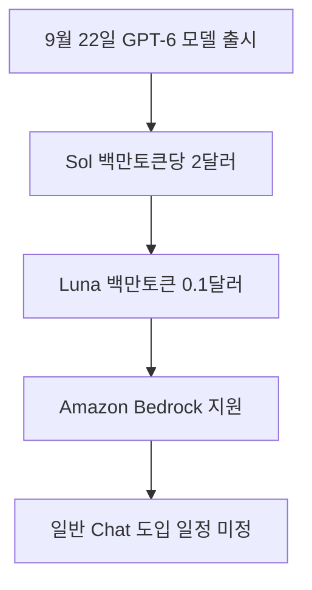

OpenAI가 2026년 9월 22일 새로운 주력 인공지능 모델인 GPT-6 Sol과 경량 모델 GPT-6 Luna를 공식 발표하며 인공지능 가격 체계를 크게 낮췄습니다 <sup class="source-citation"><a href="#source-1" aria-label="OpenAI 출처">[1]</a></sup>. 업무용 소프트웨어 개발이나 사내 데이터 처리를 고민하던 분들에게 **GPT-6 Sol과 GPT-6 Luna의 이용 요금이 이전 대비 50퍼센트 인하**된 소식은 개발 비용 부담을 단번에 덜어주는 직접적인 변화입니다. 이제 비싼 유지비 걱정 때문에 인공지능 도입을 망설였던 팀들도 훨씬 낮은 진입 장벽으로 최신 도구를 도입할 수 있게 되었습니다.

> **먼저 알아둘 용어**
>
> - **토큰**: AI가 글을 잘게 쪼개 세는 단위입니다. 한국어는 보통 한두 글자가 토큰 하나입니다.
{: .prompt-info }

## 무슨 일이 벌어진 걸까?

OpenAI는 2026년 9월 22일 플래그십 모델 GPT-6 Astra에 이어 제품군을 넓히는 GPT-6 Sol과 GPT-6 Luna를 전격 출시했습니다 <sup class="source-citation"><a href="#source-1" aria-label="OpenAI 출처">[1]</a></sup>. 이번 발표는 최상위 모델의 강력한 성능을 기업 실무에 맞게 다듬고, 요금을 절반 수준으로 낮춰 대규모 작업에 적합하게 만든 것이 핵심입니다. 다양한 업무 파이프라인에서 실제 비용 효율을 극대화하도록 설계된 모델들입니다.

새로 나온 모델의 요금표를 들여다보면 변화의 폭이 확연하게 드러납니다. GPT-6 Sol의 API(프로그래밍 인터페이스, 서로 다른 소프트웨어가 대화하는 연결 통로) 요금은 입력 토큰 백만 개당 2달러, 출력 토큰 백만 개당 10달러로 책정되었습니다 <sup class="source-citation"><a href="#source-1" aria-label="OpenAI 출처">[1]</a></sup>. 여기서 토큰은 인공지능이 글자를 읽고 이해하는 기본 단위입니다. 이 가격은 기존의 GPT-5.6 Sol과 비교했을 때 **이전 세대 대비 50퍼센트 가격 인하**를 이뤄낸 수치입니다 <sup class="source-citation"><a href="#source-3" aria-label="MacRumors 출처">[3]</a></sup>.

대량의 서류 처리나 반복 자동화 작업을 담당할 GPT-6 Luna는 가격 장벽을 훨씬 더 공격적으로 낮췄습니다. GPT-6 Luna는 입력 토큰 백만 개당 0.10달러, 출력 토큰 백만 개당 0.50달러로 출시되어 수많은 문서를 쉼 없이 읽어 들이는 작업에 최적화되었습니다 <sup class="source-citation"><a href="#source-1" aria-label="OpenAI 출처">[1]</a></sup>. 실무진 입장에서는 시스템 운영비를 계산할 때 자릿수가 달라지는 셈입니다. 일상적인 분류나 데이터 추출 작업에서 엄청난 예산 절감 효과를 기대할 수 있습니다.

제공 채널도 매우 넓습니다. 두 모델은 OpenAI API뿐만 아니라 ChatGPT Work, 프로그래밍 도구인 Codex에 배포되었으며 클라우드 플랫폼인 Amazon Bedrock에서도 정식 지원을 시작했습니다 <sup class="source-citation"><a href="#source-2" aria-label="Amazon Web Services 출처">[2]</a></sup>. 또한 OpenAI는 데스크톱 애플리케이션을 통해 Free 등급과 Go 등급 사용자에게 GPT-6 Luna를 써볼 수 있도록 열어두었습니다 <sup class="source-citation"><a href="#source-1" aria-label="OpenAI 출처">[1]</a></sup>. 다양한 환경에서 실무자들이 손쉽게 접근할 수 있도록 채널을 확장한 셈입니다.

기존 인프라를 유지하면서도 모델을 즉시 교체할 수 있는 유연성을 제공합니다. 기업들은 별도의 복잡한 마이그레이션 과정 없이 기존 API 호출 엔드포인트를 변경하는 것만으로 새로운 성능과 가격 혜택을 온전히 누릴 수 있습니다. 많은 기업 실무자들이 이번 출시 소식에 즉각적으로 반응하는 이유가 바로 여기에 있습니다.

| 모델 이름 | 백만 입력 토큰당 가격 | 백만 출력 토큰당 가격 | 주요 배포 채널 |
| --- | --- | --- | --- |
| GPT-6 Sol | 2달러 | 10달러 | OpenAI API, Codex, ChatGPT Work, Amazon Bedrock |
| GPT-6 Luna | 0.10달러 | 0.50달러 | OpenAI API, 데스크톱 앱(Free 및 Go), Amazon Bedrock |

<figure class="news-source-image">
  
  <figcaption>OpenAI가 원문과 함께 공개한 이미지입니다. <a href="https://openai.com/index/introducing-gpt-6-sol-and-luna" target="_blank" rel="noopener noreferrer">출처: OpenAI</a></figcaption>
</figure>

## 왜 지금 다들 이 이야기를 할까?

GPT-6 Sol과 GPT-6 Luna가 업계의 시선을 모으는 이유는 고성능 인공지능 모델의 운영 단가를 단숨에 절반으로 깎아냈기 때문입니다 <sup class="source-citation"><a href="#source-1" aria-label="OpenAI 출처">[1]</a></sup>. 최근까지 많은 기업과 개발팀은 인공지능이 코드를 짜거나 문서를 정리할 때 발생하는 막대한 토큰 비용 때문에 상용 서비스 적용을 주저해 왔습니다. 지속적인 비용 압박은 실무 도입의 가장 큰 장애물이었습니다.

특히 단순한 요금 인하에 그치지 않고 신뢰도 평가에서 유의미한 진전이 확인되었다는 점이 화제를 키우고 있습니다. 내부 평가 결과에 따르면 GPT-6 Sol은 GPT-5.6 Sol과 비교했을 때 **사실 오류 발생 빈도가 약 절반 수준으로 감소**했습니다 <sup class="source-citation"><a href="#source-3" aria-label="MacRumors 출처">[3]</a></sup>. 인공지능이 사실이 아닌 내용을 마치 진짜처럼 꾸며내는 이른바 할루시네이션(환각 현상) 문제를 크게 줄인 것입니다. 비즈니스 환경에서 결과물의 신뢰성은 비용만큼이나 결정적인 요소입니다.

코딩 작업에서의 안전성도 개선되었습니다. GPT-6 Sol은 자기가 짠 프로그램 코드에 대해 잘못된 설명을 덧붙이거나 허위로 안내하는 오도된 주장 비율을 낮췄습니다 <sup class="source-citation"><a href="#source-1" aria-label="OpenAI 출처">[1]</a></sup>. 개발자가 인공지능이 작성한 코드를 일일이 검토하느라 들이던 검증 피로를 덜어줄 수 있는 중요한 지점입니다. 프로그램 개발 속도와 안정성을 동시에 높일 수 있는 발판이 마련되었습니다.

여기에 더해 아마존의 기업용 클라우드 서비스인 Amazon Bedrock에서 출시 당일 곧바로 이용할 수 있게 되면서, 이미 자체 클라우드 인프라를 구축해 둔 대기업들도 별도의 복잡한 계약 없이 클릭 몇 번으로 시스템에 붙여 쓸 수 있게 되었습니다 <sup class="source-citation"><a href="#source-2" aria-label="Amazon Web Services 출처">[2]</a></sup>. 인공지능 모델의 도입 속도가 이전과는 비교할 수 없을 정도로 빨라진 셈입니다. 보안과 규정 준수를 중시하는 엔터프라이즈 시장에서도 즉각적인 도입이 가능해졌습니다.

```chartjs
{
  "type": "bar",
  "data": {
    "labels": ["GPT-6 Luna 입력", "GPT-6 Luna 출력", "GPT-6 Sol 입력", "GPT-6 Sol 출력"],
    "datasets": [
      {
        "label": "백만 토큰당 가격(달러)",
        "data": [0.1, 0.5, 2.0, 10.0]
      }
    ]
  },
  "options": {
    "plugins": {
      "title": {
        "display": true,
        "text": "GPT-6 Sol 및 GPT-6 Luna API 백만 토큰당 가격 비교"
      }
    }
  }
}
```

위 차트를 살펴보면 경량 모델인 GPT-6 Luna가 대량 처리를 위해 얼마나 낮은 단가로 설계되었는지 한눈에 확인할 수 있습니다. 주력 모델인 GPT-6 Sol 역시 기존 대비 절반의 요금으로 강력한 성능을 제공합니다. 이는 개발팀이 작업의 경중에 맞춰 모델을 전략적으로 교차 배치할 수 있음을 보여줍니다.

<figure class="news-source-image">
  
  <figcaption>OpenAI가 원문과 함께 공개한 이미지입니다. <a href="https://openai.com/index/introducing-gpt-6-sol-and-luna" target="_blank" rel="noopener noreferrer">출처: OpenAI</a></figcaption>
</figure>

## 그래서 우리에게 뭐가 달라질까?

일반 실무자와 소프트웨어 개발자가 피부로 느끼게 될 가장 큰 변화는 더 적은 예산으로 더 똑똑한 인공지능 비서를 작업 흐름에 둘 수 있게 되었다는 점입니다 <sup class="source-citation"><a href="#source-1" aria-label="OpenAI 출처">[1]</a></sup>. 예를 들어 매일 수많은 보고서나 고객 응대 기록을 정리해야 하는 업무 환경이라면 고가의 모델 대신 GPT-6 Luna를 연결해 비용을 아낄 수 있습니다. 정형화된 반복 업무를 저렴하게 자동화할 수 있는 길이 열렸습니다.

소프트웨어 엔지니어링 현장에서도 체감 폭이 큽니다. 프로그래밍 도구인 Codex에 GPT-6 Sol이 적용되면서 복잡한 다단계 코드 작성이나 디버깅(프로그램의 결함과 오류를 찾아내 고치는 과정) 작업을 맡길 때 비용 부담이 이전의 절반으로 줄었습니다 <sup class="source-citation"><a href="#source-1" aria-label="OpenAI 출처">[1]</a></sup>. 코딩을 보조하는 도구가 거짓 주장을 덜하게 되면서 개발 흐름이 중간에 끊기는 일도 줄어듭니다. 이는 개발자들의 생산성을 실질적으로 끌어올리는 효과를 낳습니다.

또한 데스크톱 프로그램을 주로 사용하는 일반 Free 등급이나 Go 등급 이용자들도 주목할 만합니다. OpenAI가 데스크톱 애플리케이션을 통해 **GPT-6 Luna 접근을 Free 및 Go 등급 사용자에게 제공**하기 시작했기 때문입니다 <sup class="source-citation"><a href="#source-1" aria-label="OpenAI 출처">[1]</a></sup>. 값비싼 구독료를 내지 않더라도 일상적인 문서 정리나 빠른 질의응답에 최신 6세대 모델 기반의 가벼운 처리를 경험해 볼 수 있습니다. 작업용 PC에서 바로 도구를 불러와 활용할 수 있어 편리합니다.

기업 내부 보안과 규정을 지켜야 하는 관리자 입장에서도 변화가 큽니다. 사내 데이터를 OpenAI 서버로 직접 보내는 것을 꺼렸던 조직은 이미 사용 중인 Amazon Bedrock 인프라 안에서 GPT-6 Sol과 GPT-6 Luna를 곧바로 활성화할 수 있어 데이터 관리의 안정성을 확보하게 되었습니다 <sup class="source-citation"><a href="#source-2" aria-label="Amazon Web Services 출처">[2]</a></sup>. 기존 보안 체계와 거버넌스를 해치지 않고 최신 인공지능을 도입할 수 있다는 점은 기업 실무자에게 커다란 안도감을 줍니다.

결과적으로 개인 사용자부터 거대 기업 엔지니어링 팀까지 각자의 위치에서 실질적인 효율 개선을 경험하게 됩니다. 높은 비용 장벽과 환각 현상에 대한 불안 때문에 도입을 주저했던 많은 조직이 본격적인 인공지능 자동화 파이프라인 구축에 나설 수 있게 되었습니다.

<figure class="news-source-image">
  
  <figcaption>OpenAI가 원문과 함께 공개한 이미지입니다. <a href="https://openai.com/index/introducing-gpt-6-sol-and-luna" target="_blank" rel="noopener noreferrer">출처: OpenAI</a></figcaption>
</figure>

## 그래서 내 업무에는 뭐가 달라지나

개발자가 아닌 실무자나 비즈니스 기획자도 오늘 당장 자신의 업무 방식에 맞춰 실행 가능한 조치를 취해볼 수 있습니다. 발표된 지원 환경에 맞춰 지금 실행할 수 있는 행동은 다음과 같습니다.

먼저 PC에 설치된 데스크톱 프로그램을 열고 Free 또는 Go 계정 환경에서 새롭게 연동된 GPT-6 Luna를 활용해 보세요 <sup class="source-citation"><a href="#source-1" aria-label="OpenAI 출처">[1]</a></sup>. 회의록이나 긴 메모를 정리하는 일상적인 타이핑 업무를 훨씬 빠르고 가볍게 처리할 수 있습니다. 별도의 유료 결제 없이도 최신 경량 모델의 반응 속도를 체감할 수 있습니다.

다음으로 사내 시스템에 인공지능 API를 연동해 쓰고 있다면 기존 GPT-5.6 Sol 호출 설정을 GPT-6 Sol로 변경해 보세요 <sup class="source-citation"><a href="#source-1" aria-label="OpenAI 출처">[1]</a></sup>. 백만 토큰당 입력 2달러, 출력 10달러 요금이 적용되어 **API 운영 예산을 50퍼센트 절감**하면서도 사실 오류가 반으로 줄어든 답변을 얻을 수 있습니다. 코드 몇 줄을 수정하는 것만으로 이번 달 인프라 비용 청구액을 절반 수준으로 낮출 수 있습니다.

마지막으로 AWS 클라우드 환경을 사용하는 팀이라면 Amazon Bedrock 콘솔에 접속해 모델 카탈로그에서 GPT-6 Sol과 GPT-6 Luna 권한을 활성화해 두세요 <sup class="source-citation"><a href="#source-2" aria-label="Amazon Web Services 출처">[2]</a></sup>. 사내 규정 검토가 끝나는 대로 즉시 프로젝트 파이프라인에 투입할 수 있습니다. 사전 권한 신청을 미리 마쳐두면 실제 프로젝트 투입 시 불필요한 대기 시간을 없앨 수 있습니다.

단순히 뉴스를 지켜보는 데 그치지 않고 현재 사용하는 인공지능 도구의 설정 화면이나 데스크톱 앱 버전을 점검해 보는 것만으로도 작업 효율과 비용을 동시에 개선할 수 있습니다. 일상적인 업무 루틴 안에서 최신 도구를 적극적으로 테스트해 보시길 권합니다.

<figure class="news-source-image">
  
  <figcaption>OpenAI가 원문과 함께 공개한 이미지입니다. <a href="https://openai.com/index/introducing-gpt-6-sol-and-luna" target="_blank" rel="noopener noreferrer">출처: OpenAI</a></figcaption>
</figure>

## 아직은 선을 그어야 할 부분

모든 사용자가 곧바로 웹 브라우저에서 이 모델들을 쓸 수 있는 것은 아닙니다. OpenAI는 이번 발표와 함께 **두 모델 모두 일반 소비자용 ChatGPT Chat에는 아직 제공되지 않는다**는 제한 사항을 확인했습니다 <sup class="source-citation"><a href="#source-1" aria-label="OpenAI 출처">[1]</a></sup>. 평소 웹사이트에서 기본 대화창을 사용하는 분들에게는 아직 모델 선택 메뉴에 나타나지 않습니다. 따라서 웹 브라우저만 사용하는 일반 사용자는 즉시 변화를 체감하기 어렵습니다.

일반 대화창에 언제 적용될지도 미정입니다. GPT-6 Sol과 GPT-6 Luna가 일반 소비자용 대화창에 정식으로 들어오는 구체적인 일정은 아직 발표되지 않았으므로 <sup class="source-citation"><a href="#source-1" aria-label="OpenAI 출처">[1]</a></sup>, 웹 기반 서비스만 사용하는 분들은 추가 공지를 기다려야 합니다. 막연한 기대보다는 공식 지원 경로를 먼저 확인하는 자세가 필요합니다.

제품 라인업의 빈자리도 짚고 넘어가야 합니다. 이전 세대에서 중간급 역할을 맡았던 계열 모델의 후속작이 빠져 있습니다. OpenAI가 중간 단계인 GPT-6 Terra 모델을 향후 추가로 내놓을 계획이 있는지, 아니면 해당 라인업을 완전히 접었는지는 현재로선 공식 확인되지 않았습니다. 포트폴리오의 공백이 전략적 단순화인지 아니면 추후 추가 발표가 있을지는 지켜보아야 합니다.

마지막으로 내부 평가에서 오류가 줄어들었다고 해서 인공지능의 모든 답변이 완벽하다는 뜻은 아닙니다. GPT-6 Sol이 사실 오류 발생을 절반가량 줄이고 코드 설명 왜곡을 완화했다고 하더라도 <sup class="source-citation"><a href="#source-3" aria-label="MacRumors 출처">[3]</a></sup>, 법률이나 금융처럼 정밀함이 요구되는 업무에서는 반드시 담당자가 최종 결과를 검증하는 단계를 거쳐야 합니다. 기술의 발전 속도와 무관하게 인간 전문가의 최종 검토는 여전히 필수적인 안전장치입니다.

<!-- primary-sources:start -->
## 원문과 버전 확인

- [발표 원문](https://openai.com/index/introducing-gpt-6-sol-and-luna)
- [Amazon Web Services](https://aws.amazon.com/blogs/machine-learning/bring-more-intelligence-to-everyday-work-with-gpt-6-sol-and-gpt-6-luna-on-amazon-bedrock)
- [MacRumors](https://www.macrumors.com/2026/09/22/openai-gpt-6-sol-luna)
<!-- primary-sources:end -->

<!-- internal-links:start -->
## 함께 읽으면 이해가 이어지는 글

- [공개된 AI 시스템 프롬프트를 그대로 복사해도 될까? 저장소 활용 기준]() — 여러 AI 도구의 시스템 프롬프트를 모은 저장소에서 역할, 제약, 출력 형식을 분석하는 법과 진위, 버전, 저작권을 확인해야 하는 이유를 정리합니다.
- [OpenMontage로 AI 영상을 만들 때: 에이전트 파이프라인, 비용, 검수 기준]() — OpenMontage가 YAML 파이프라인, Markdown 스킬, Python 도구, Remotion과 FFmpeg를 연결해 영상 제작 단계를 조율하는 방식을 설명합니다. 설치 비용, 사람 승인, 재현성과 보안까지 포함한 파일럿…
- [OpenAI의 2026년 상장 공식 철회와 Sam Altman이 밝힌 AI 안전 문제]() — 2026년 9월 12일 OpenAI CEO Sam Altman은 회사가 2026년에 상장하지 않는다고 밝혔습니다. 인공지능 안전과 인간 의도 일치 문제를 해결하기 위해 주주의 단기 이익 대신 비상장사의 개발 자율성을 지키겠다는…
<!-- internal-links:end -->

## 자주 묻는 질문

### 일반 웹 브라우저의 ChatGPT 무료 대화창에서 GPT-6 Sol을 바로 쓸 수 있나요?

아닙니다. GPT-6 Sol과 GPT-6 Luna는 일반 소비자용 ChatGPT 대화창에 아직 도입되지 않았으며 구체적인 지원 일정도 공개되지 않았습니다. 현재는 OpenAI API, ChatGPT Work, Codex, Amazon Bedrock 및 데스크톱 앱의 일부 등급에서만 이용할 수 있습니다.

### GPT-6 Sol의 API 이용 요금은 이전 모델과 비교해 얼마나 저렴해졌나요?

기존 GPT-5.6 Sol과 비교해 정확히 50퍼센트 저렴해졌습니다. 새로운 GPT-6 Sol의 요금은 백만 입력 토큰당 2달러, 백만 출력 토큰당 10달러로 책정되었습니다.

### 가장 저렴한 GPT-6 Luna 모델은 얼마에 이용할 수 있나요?

GPT-6 Luna는 백만 입력 토큰당 0.10달러, 백만 출력 토큰당 0.50달러에 이용할 수 있습니다. 대량의 텍스트 처리와 일상적인 서류 자동화 파이프라인에 최적화된 가격 체계입니다.

### Amazon Bedrock 클라우드를 쓰는 기업도 별도 신청 없이 바로 쓸 수 있나요?

그렇습니다. GPT-6 Sol과 GPT-6 Luna는 2026년 9월 22일 출시와 동시에 Amazon Bedrock에서 정식 제공을 시작했으므로 클라우드 콘솔을 통해 즉시 활성화할 수 있습니다.

## 직접 확인한 원문

<ol class="checked-source-list">
  <li id="source-1"><a href="https://openai.com/index/introducing-gpt-6-sol-and-luna" target="_blank" rel="noopener noreferrer">OpenAI — Introducing GPT-6 Sol and Luna</a> (2026-09-22)</li>
  <li id="source-2"><a href="https://aws.amazon.com/blogs/machine-learning/bring-more-intelligence-to-everyday-work-with-gpt-6-sol-and-gpt-6-luna-on-amazon-bedrock" target="_blank" rel="noopener noreferrer">Amazon Web Services — Bring more intelligence to everyday work with GPT-6 Sol and GPT-6 Luna on Amazon Bedrock</a> (2026-09-22)</li>
  <li id="source-3"><a href="https://www.macrumors.com/2026/09/22/openai-gpt-6-sol-luna" target="_blank" rel="noopener noreferrer">MacRumors — OpenAI&#x27;s New GPT-6 Sol and Luna Models Bring Astra Improvements to Cheaper Tiers</a> (2026-09-22)</li>
</ol>

> 이 글은 위 원문을 직접 확인해 작성했습니다. 가격, 기능 범위, 지역별 제공 여부는 게시 후 바뀔 수 있으니 실제 도입 전 공식 문서를 다시 확인하세요.
